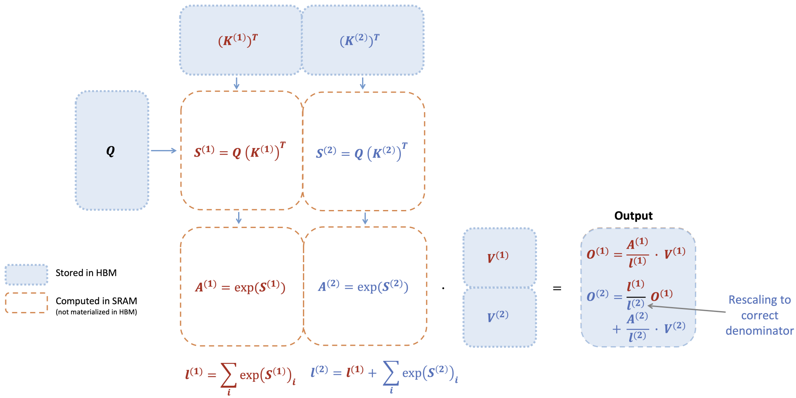

# Flash Attention

## Self-Attention

$$
S = QK^T,(N \times N)
$$
$$
P = softmax(S), (N \times N)
$$
$$
O = PV, (N \times d)
$$

其中， softmax 是按行应用的。

综上， Attention 算法的基本公式：

$$
\mathrm{Attention}(Q,K,V)=\mathrm{softmax}(\frac{QK^{T}}{\sqrt{d}})V
$$


传统的 attention 的 cuda 实现思路是:

- 要求 Q, K, V 存储在 HBM 中
- 按块从 HBM 加载 Q，K，通过 GEMM 计算 $S = QK^T$， 将 S 写入 HBM
- 从 HBM 读取 S，计算 $P = \mathrm{softmax}(\frac{S}{\sqrt{d}})$，将 P  写入 HBM
- 按块从 HBM 加载 P 和 V，通过 GEMM 计算 $O = PV$，将 O 写入 HBM
- 返回 O

可以看到，涉及到多次 HBM 的读写，导致延迟很高，成为制约 Attention 算法性能的瓶颈。

### Safe Softmax

$$
safe\ softmax = \frac{e^{x_i -m}}{\sum_{j=1}^{N}e^{x_j-m}}
$$

计算 safe-softmax 的时候需要对 `[1, N]` 重复三次，需要访问 `Q` 和 `K` 三次， 并实时重新计算 `x`，这样会很低效，所以需要将计算进行合并。

现在定义:

$$
d_{i}^{'} = \sum_{j=1}^{i}e^{x_j - m_i}
$$

当 $i = N$ 的时候，有：

$$
d_N = d_{N}^{'} = \sum_{j=1}^{i}e^{x_j - m_N}
$$

$d_{i}^{'}$ 和 $d_{i-1}^{'}$ 有如下递归关系：

$$
d_{i}^{'} = \sum_{j=1}^{i}e^{x_j - m_i} \\
= (\sum_{j=1}^{i-1}e^{x_j - m_i}) + e^{x_i - m_i} \\
= (\sum_{j=1}^{i-1}e^{x_j - m_{i-1}})e^{m_{i-1} - m_i} + e^{x_i - m_i} \\
= d_{i-1}^{'}e^{m_{i-1} - m_i} + e^{x_i - m_i}
$$

递归关系只依赖 $m_{i-1}$ 和 $m_i$，于是可以把 $d_i^{'}$ 和 $m_i$ 放在同一个循环中。

## flash attention 1

#### paper

<https://arxiv.org/pdf/2205.14135>

#### softmax 分块

online softmax 最多只有一个 `2-pass` 的算法，不存在 `1-pass` 算法，但是 `attention` 可以有 `1-pass` 算法。基于上述的 online softmax 可以得到一个 `1-pass`的 attention 算法。

重点在第二个循环：

$$
a_i = \frac{e^{x_i - m_N}}{d_N^{'}} \\
o_i = o_{i-1} + a_i V[i,:]
$$

推导 `1-pass` 版本的 flash attention:

$$
o_i^{'} = (\sum_{j=1}^i (\frac{e^{x_j - m_i}}{d_i^{'}})V[j,:]) \\
$$

当 $i= N$ 时有：

$$
o_N^{'} = o_N = (\sum_{j=1}^i (\frac{e^{x_j - m_N}}{d_N^{'}})V[j,:]) \\
$$

推导 $o_{i}{'}$ 和 $o_{i-1}{'}$ 之间的关系：

$$
o_i^{'} = (\sum_{j=1}^i (\frac{e^{x_j - m_i}}{d_i^{'}})V[j,:])
$$
$$
= (\sum_{j=1}^{i-1} (\frac{e^{x_j - m_i}}{d_i^{'}})V[j,:]) + (\frac{e^{x_i - m_i}}{d_i^{'}})V[i,:]
$$
$$
= (\sum_{j=1}^{i-1} (\frac{e^{x_j - m_{i-1}}}{d_i^{'}})\frac{e^{x_j-m_i}}{e^{x_j-m_{i-1}}}\frac{d_{i-1}^{'}}{d_{i}^{'}}V[j,:]) + (\frac{e^{x_i - m_i}}{d_i^{'}})V[i,:]
$$
$$
= o_{i-1}^{'}\frac{d_{i-1}^{'}e^{m_{i-1} - m_i}}{d_i^{'}} + (\frac{e^{x_i - m_i}}{d_i^{'}})V[i,:]
$$

可以看到 $o_i^{'}$ 和 $o_{i-1}^{'}$ 递归关系不依赖 $m_n$，因此可以将第二个循环完全合并到第一个循环中去。

按照上面的算法，对于很长的向量，可以将其分成不同的子向量，然后通过逐步计算并整合子向量，来得到最终的 softmax 值。 这正是 Flash Attention 1 采用的思想。

Flash Attention 1 的主要思路是将 K，V 矩阵分块，然后通过循环逐个加载到共享内存。然后计算 Q 对该分块的注意力结果。如下图所示。


#### 算法伪代码


#### flash attention 1 的简单实现

```c++
#include <torch/types.h>
#include <cuda.h>
#include <cuda_runtime.h>

__global__
void forward_kernel(
    const float* Q,     // 形状: [B, nh, N, d] - 查询矩阵
    const float* K,     // 形状: [B, nh, N, d] - 键矩阵
    const float* V,     // 形状: [B, nh, N, d] - 值矩阵
    const int N,        // 标量 - 序列长度
    const int d,        // 标量 - 特征维度
    const int Tc,       // 标量 - K,V的块数量 (向上取整 N/Bc)
    const int Tr,       // 标量 - Q的块数量 (向上取整 N/Br)
    const int Bc,       // 标量 - 列块大小
    const int Br,       // 标量 - 行块大小
    const float softmax_scale, // 标量 - softmax缩放因子 (1/sqrt(d))
    float* l,           // 形状: [B, nh, N] - 每行的累加器值
    float* m,           // 形状: [B, nh, N] - 每行的最大值
    float* O            // 形状: [B, nh, N, d] - 输出矩阵
) {
    // tx: 当前线程在块内的索引; bx, by: 当前块在网格中的索引，对应批次和注意力头
    int tx = threadIdx.x;  // 标量 - 线程在块内的索引
    int bx = blockIdx.x;   // 标量 - 批次索引
    int by = blockIdx.y;   // 标量 - 注意力头索引

    // 计算Q,K,V,O,l,m的偏移量 - 每个批次和头都有不同的偏移
    // Offset into Q,K,V,O,l,m - different for each batch and head
    int qkv_offset = (bx * gridDim.y * N * d) + (by * N * d);  // 标量 - Q,K,V,O的起始偏移
    int lm_offset = (bx * gridDim.y * N) + (by * N);           // 标量 - l和m的起始偏移

    // 在共享内存中为Q,K,V,S分配空间
    // Define SRAM for Q,K,V,S
    extern __shared__ float sram[];                // 共享内存数组
    int tile_size = Bc * d;                        // 标量 - 每个块(tile)的大小
    float* Qi = sram;                              // 形状: [Br, d] - 当前Q块
    float* Kj = &sram[tile_size];                  // 形状: [Bc, d] - 当前K块
    float* Vj = &sram[tile_size * 2];              // 形状: [Bc, d] - 当前V块
    float* S = &sram[tile_size * 3];               // 形状: [Br, Bc] - 注意力分数矩阵

    // 外循环：遍历所有的K和V块
    for (int j = 0; j < Tc; j++) {

        // 将K和V的第j个块加载到共享内存
        // Load Kj, Vj to SRAM
        for (int x = 0; x < d; x++) {
            Kj[(tx * d) + x] = K[qkv_offset + (tile_size * j) + (tx * d) + x];  // 填充Kj[tx, x]
            Vj[(tx * d) + x] = V[qkv_offset + (tile_size * j) + (tx * d) + x];  // 填充Vj[tx, x]
        }
        __syncthreads();  // 同步所有线程，确保Kj和Vj完全加载后再继续

        // 内循环：遍历所有Q块，计算与当前K,V块的注意力
        for (int i = 0; i < Tr; i++)  {

            // 将Q的第i个块加载到共享内存，同时加载对应的l和m到寄存器
            // Load Qi to SRAM, l and m to registers
            for (int x = 0; x < d; x++) {
                Qi[(tx * d) + x] = Q[qkv_offset + (tile_size * i) + (tx * d) + x];  // 填充Qi[tx, x]
            }
            // 读取当前行的前一个最大值和累加器值
            float row_m_prev = m[lm_offset + (Br * i) + tx];    // 标量 - 之前计算的最大值
            float row_l_prev = l[lm_offset + (Br * i) + tx];    // 标量 - 之前计算的累加器值

            // 计算S = Q*K^T并找出每行的最大值row_m
            // S = QK^T, row_m = rowmax(S)
            float row_m = -INFINITY;  // 标量 - 初始化当前块的行最大值
            for (int y = 0; y < Bc; y++) {
                float sum = 0;  // 标量 - 点积结果
                // 计算点积
                for (int x = 0; x < d; x++) {
                    sum += Qi[(tx * d) + x] * Kj[(y * d) + x];  // Qi[tx, x] * Kj[y, x]
                }
                // 应用softmax缩放因子
                sum *= softmax_scale;
                S[(Bc * tx) + y] = sum;  // 填充S[tx, y]

                // 更新当前行的最大值
                if (sum > row_m)
                    row_m = sum;
            }

            // 计算P = exp(S - row_m)并求每行的和row_l
            // P = exp(S - row_m), row_l = rowsum(P)
            float row_l = 0;  // 标量 - 初始化当前块的行和
            for (int y = 0; y < Bc; y++) {
                // 应用数值稳定性技巧：减去行最大值后再计算exp
                S[(Bc * tx) + y] = __expf(S[(Bc * tx) + y] - row_m);  // 更新S[tx, y]为exp值
                row_l += S[(Bc * tx) + y];  // 累加当前行的和
            }

            // 计算新的m和l值，使用Flash Attention中的在线softmax更新公式
            // Compute new m and l
            float row_m_new = max(row_m_prev, row_m);  // 标量 - 新的最大值
            // 使用在线softmax更新公式更新累加器
            float row_l_new = (__expf(row_m_prev - row_m_new) * row_l_prev) + (__expf(row_m - row_m_new) * row_l);  // 标量 - 新的累加器值

            // 更新输出O，并将新的l和m写回全局内存
            // Write O, l, m to HBM
            for (int x = 0; x < d; x++) {
                float pv = 0;  // 标量 - 计算当前块的P*V结果
                for (int y = 0; y < Bc; y++) {
                    pv += S[(Bc * tx) + y] * Vj[(y * d) + x];  // S[tx, y] * Vj[y, x]
                }
                // 使用Flash Attention中的在线softmax更新公式更新输出
                O[qkv_offset + (tile_size * i) + (tx * d) + x] = (1 / row_l_new) \
                    * ((row_l_prev * __expf(row_m_prev - row_m_new) * O[qkv_offset + (tile_size * i) + (tx * d) + x]) \
                    + (__expf(row_m - row_m_new) * pv));  // 更新O[b, h, i*Br+tx, x]
            }
            // 将新的m和l值写回全局内存
            m[lm_offset + (Br * i) + tx] = row_m_new;  // 更新m[b, h, i*Br+tx]
            l[lm_offset + (Br * i) + tx] = row_l_new;  // 更新l[b, h, i*Br+tx]
        }
        __syncthreads();  // 同步所有线程，确保下一次迭代使用正确的Kj, Vj
    }
}

torch::Tensor forward(torch::Tensor Q, torch::Tensor K, torch::Tensor V) {
    // Bc和Br是块大小(每个CUDA块处理的序列长度)
    // TODO: determine Bc, Br dynamically
    const int Bc = 32; const int Br = 32;

    // 获取输入张量的维度
    const int B = Q.size(0); const int nh = Q.size(1);  // 批次大小和注意力头数
    const int N = Q.size(2); const int d = Q.size(3);   // 序列长度和特征维度

    // 计算块的数量(向上取整)
    const int Tc = ceil((float) N / Bc); const int Tr = ceil((float) N / Br);
    // 计算softmax的缩放因子(1/sqrt(d))
    const float softmax_scale = 1.0 / sqrt(d);

    // 初始化输出张量O和辅助张量l, m
    // Initialize O, l, m to HBM
    auto O = torch::zeros_like(Q);                     // 输出张量初始化为0
    auto l = torch::zeros({B, nh, N});                 // l张量存储每行的累加器值
    auto m = torch::full({B, nh, N}, -INFINITY);       // m张量存储每行的最大值，初始化为负无穷
    torch::Device device(torch::kCUDA);                // 设置设备为CUDA
    l = l.to(device); m = m.to(device);                // 将l和m移到GPU上

    // 计算每个块需要的共享内存大小
    // Calculate SRAM size needed per block
    const int sram_size = (3 * Bc * d * sizeof(float)) + (Bc * Br * sizeof(float));  // Q,K,V各占Bc*d，S占Bc*Br
    int max_sram_size;
    // 获取设备支持的最大共享内存大小
    cudaDeviceGetAttribute(&max_sram_size, cudaDevAttrMaxSharedMemoryPerBlock, 0);
    printf("Max shared memory: %d, requested shared memory: %d \\n", max_sram_size, sram_size);

    // 设置CUDA网格和块维度
    dim3 grid_dim(B, nh);  // 网格维度为批次大小 x 注意力头数
    dim3 block_dim(Bc);  // 每个块有Bc个线程

    // 启动CUDA内核
    forward_kernel<<<grid_dim, block_dim, sram_size>>>(
        Q.data_ptr<float>(), K.data_ptr<float>(), V.data_ptr<float>(),
        N, d, Tc, Tr, Bc, Br, softmax_scale,
        l.data_ptr<float>(), m.data_ptr<float>(), O.data_ptr<float>()
    );
    return O;  // 返回计算结果
}
```

## flash attention 2

#### paper

<https://tridao.me/publications/flash2/flash2.pdf>

#### 思路

flash attention 通过 Tiling (分块)和 Recomputation 技术大幅减少了 cuda kernel 对 global memory 的访问量，显著节省了内存（线性而非二次）并加快了运行时间（相比优化基线提高了 2-4 倍），并且计算结果是精确而非近似的。但 flash attention 依然远达不到优化矩阵乘法（GEMM）操作的速度，仅达到理论最大 FLOPs/s 的 25-40%。

这种低效是**因为 GPU 上不同线程块和 warp 之间的工作分配不理想，导致了 SM 低占用率或不必要的共享内存读写**。于是提出了 flash attention 2，通过改进并行性和工作划分来解决这些问题。

主要做了工程上的优化：

- 减少大量非矩阵乘的冗余计算，增加 Tensor Core 的计算比例。
- forward pass/backward pass 均增加 seq_len 维度的并行，forward pass 交替 Q，K，V 循环顺序。
- 更好的 Warp Partitioning 策略，避免 Split-K。

#### 回顾下 flash attention 1

flash attention 使用经典的 `tiling` 即分块技术来减少内存 IO 操作，**flash attention 实现步骤**：

1. 将输入块从 HBM 加载到 SRAM
2. 针对该块计算注意力
3. 更新输出而无需将大型中间矩阵 S 和 P 写入 HBM。

由于 softmax 会耦合整个行或行块，online softmax 可以将注意力计算划分为多个块，并重新缩放每个块的输出，最终得到正确结果（无近似）。通过显著减少内存的读写操作，flash attention 相比优化后的基准注意力实现提升了 2-4 倍的运行时间。

##### online softmax 技术

假设只考虑注意力矩阵 $S$ 的一个行块，形式为 $[S^{(1)}\quad S^{(2)}]$，其中矩阵 $S^{(1)}, S^{(2)} \in R^{B_r\times B_c}$，$B_r$ 和 $B_c$ 分别是行块和列块的大小。目标是对这个行块进行 softmax 计算并与 $V = [V^{(1)}\quad V^{(2)}]$ 矩阵相乘，其中矩阵 $V^{(1)}, V^{(2)} \in R^{B_c \times d}$。

标准的 softmax 计算方式是：

$$m = \max(\text{rowmax}(S^{(1)}), \text{rowmax}(S^{(2)})) \in \mathbb{R}^{B_r}, \quad
\ell = \text{rowsum}(e^{S^{(1)} - m}) + \text{rowsum}(e^{S^{(2)} - m}) \in \mathbb{R}^{B_r}$$

$$\mathbf{P} = [\mathbf{P}^{(1)} \; \mathbf{P}^{(2)}] = \text{diag}(\ell)^{-1} \left[ e^{S^{(1)} - m} \; e^{S^{(2)} - m} \right] \in \mathbb{R}^{B_r \times 2B_c}$$

$$\mathbf{O} = [\mathbf{P}^{(1)} \; \mathbf{P}^{(2)}] \begin{bmatrix} \mathbf{V}^{(1)} \\ \mathbf{V}^{(2)} \end{bmatrix} = \text{diag}(\ell)^{-1} e^{S^{(1)} - m} \mathbf{V}^{(1)} + e^{S^{(2)} - m} \mathbf{V}^{(2)} \in \mathbb{R}^{B_r \times d}$$

在线 softmax 会针对每个块计算“局部 (local)” softmax，并在最后通过重缩放得到正确的输出:

$$\begin{aligned}
    m^{(1)} &= \text{rowmax}(S^{(1)}) \in \mathbb{R}^{B_r}, \quad
    \ell^{(1)} = \text{rowsum}(e^{S^{(1)} - m^{(1)}}) \in \mathbb{R}^{B_r} \\
    \tilde{P}^{(1)} &= \text{diag}(\ell^{(1)})^{-1} e^{S^{(1)} - m^{(1)}} \in \mathbb{R}^{B_r \times B_c} \\
    \mathbf{O}^{(1)} &= \tilde{P}^{(1)} \mathbf{V}^{(1)} = \text{diag}(\ell^{(1)})^{-1} e^{S^{(1)} - m^{(1)}} \mathbf{V}^{(1)} \in \mathbb{R}^{B_r \times d} \\
    m^{(2)} &= \max(m^{(1)}, \text{rowmax}(S^{(2)})) = m \\
    \ell^{(2)} &= e^{m^{(1)} - m^{(2)}} \ell^{(1)} + \text{rowsum}(e^{S^{(2)} - m^{(2)}}) = \text{rowsum}(e^{S^{(1)} - m}) + \text{rowsum}(e^{S^{(2)} - m}) = \ell \\
    \tilde{P}^{(2)} &= \text{diag}(\ell^{(2)})^{-1} e^{S^{(2)} - m^{(2)}} \in \mathbb{R}^{B_r \times B_c} \\
    \mathbf{O}^{(2)} &= \text{diag}\left(\frac{\ell^{(2)}}{\ell^{(1)}}\right) \mathbf{O}^{(1)} + \tilde{P}^{(2)} \mathbf{V}^{(2)} = \text{diag}(\ell^{(2)})^{-1} e^{S^{(1)} - m} \mathbf{V}^{(1)} + \text{diag}(\ell^{(2)})^{-1} e^{S^{(2)} - m} \mathbf{V}^{(2)} = \mathbf{O}
\end{aligned}$$

下图展示 flash attention 1 如何使用 online softmax 实现分块处理，从而减少内存的读写操作。



当键 K 被划分为两个块、值 V 也被划分为两个块时，flash attention 的前向传播执行过程的示意图就是上图这样。通过对每个块计算注意力并重新缩放输出，最终可以得到正确的结果，同时避免了对中间矩阵 S 和 P 的昂贵的内存读写。为了简化说明，**上图省略了 softmax 过程中每个元素减去行最大值的步骤**。

在反向传播中，当输入 $Q、K、V$ 的块被加载到 SRAM 后，通过重新计算注意力矩阵 $S$ 和 $P$ 的值，flash attention 1 避免了存储大量中间值。由于不需要保存大小为 $N\times N$ 的大矩阵 S 和 P，flash attention 1 根据序列长度节省了 10-20 倍的内存（所需内存量与序列长度 $N$ 呈线性增长，而不是二次增长）。由于减少了内存读写，反向传播还实现了 2-4 倍的实际运行时间加速。

虽然从概念上来说，反向传播比前向传播更简单（没有 softmax 的重新缩放 `no softmax rescaling`），但其实现却更加复杂。因为与前向传播只需要执行 2 次矩阵乘法不同，反向传播需要在 SRAM 中保留更多数据，以执行 5 次矩阵乘法。

回顾结束。正式讲解 flash attnetion 2 的实现。

#### flash attention 2 的 Algorithm, Parallelism, and Work Partitioning

对 flash attention 1 的算法进行了调整，减少非矩阵乘法的 FLOPs 数量，因为从硬件角度看，非矩阵乘法计算速度远远低于矩阵乘法。以 A100 GPU 为例，其 FP16/BF16 矩阵乘法的理论最大吞吐量为 312 TFLOPs/s，而非矩阵乘法的 FP32 吞吐量仅为 19.5 TFLOPs/s，即非矩阵乘法 FLOP 的计算成本是矩阵乘法 FLOP 的 16 倍。

##### 前向传播

对 flash attention 1 的 online softmax 进行了两项细微调整来减少非矩阵乘法的 FLOPs:

(1) 不需要通过 $\text{diag}(\ell^{(2)})^{-1}$ 来重新缩放输出更新的两项：

$$
\begin{aligned}
\mathbf{O}^{(2)} & =\mathrm{diag}\left(\frac{\ell^{(1)}}{\ell^{(2)}}\right)^{-1}\mathbf{O}^{(1)}+\mathrm{diag}(\ell^{(2)})^{-1}e^{S^{(2)}-m^{(2)}}\mathbf{V}^{(2)} \\
\end{aligned}
$$

保留 $\tilde{\mathbf{O}}^{(2)}$ 的 "未缩放" 版本，并保留统计量 $\ell^{(2)}$：

$$
\begin{aligned}
\tilde{\mathbf{O}}^{(2)}=\mathrm{diag}(\ell^{(1)})^{-1}\tilde{\mathbf{O}}^{(1)}+e^{S^{(2)}-m^{(2)}}\mathbf{V}^{(2)}
\end{aligned}
$$

只在循环结束时将最终的 $\tilde{\mathbf{O}}^{(\text{last})}$ 通过 $\text{diag}(\ell^{(\text{last})})^{-1}$ 进行缩放，也可以得到正确的输出。


(2) 不需要保存每一块的最大值 $m^{(j)}$ 和指数和 $\ell^{(j)}$ 用于反向传播。只需要存储 $\log \text{sum exp}$，即 $L^{(j)} = m^{(j)} + \log(\ell^{(j)})$。

综上，flash attention 2 的 online softmax 优化后变为：

$$\begin{aligned}
    m^{(1)} &= \text{rowmax}(S^{(1)}) \in \mathbb{R}^{B_r} \\
    \ell^{(1)} &= \text{rowsum}(e^{S^{(1)} - m^{(1)}}) \in \mathbb{R}^{B_r} \\
    \mathbf{O}^{(1)} &= e^{S^{(1)} - m^{(1)}} \mathbf{V}^{(1)} \in \mathbb{R}^{B_r \times d} \\
    m^{(2)} &= \max(m^{(1)}, \text{rowmax}(S^{(2)})) = m \\
    \ell^{(2)} &= e^{m^{(1)} - m^{(2)}} \ell^{(1)} + \text{rowsum}(e^{S^{(2)} - m^{(2)}}) = \text{rowsum}(e^{S^{(1)} - m}) + \text{rowsum}(e^{S^{(2)} - m}) = \ell \\
    \tilde{\mathbf{P}}^{(2)} &= \text{diag}(\ell^{(2)})^{-1} e^{S^{(2)} - m^{(2)}} \\
    \tilde{\mathbf{O}}^{(2)} &= \text{diag}(e^{m^{(1)} - m^{(2)}}) \tilde{\mathbf{O}}^{(1)} + e^{S^{(2)} - m^{(2)}} \mathbf{V}^{(2)} \\
    \mathbf{O}^{(2)} &= \text{diag}(\ell^{(2)})^{-1} \tilde{\mathbf{O}}^{(2)} = 0
\end{aligned}$$

flash attention 2 的前向传播过程的完整算法如下图。


##### 反向传播

flash attention 2 的反向传播与 flash attention 1 基本相同。只做了一个小改动，softmax 中仅使用按行的 log sum exp $L$，而不是同时使用按行最大值和按行指数和。

反向传播过程的完整算法如下图。


##### 简单实现

```c++
# include <torch/types.h>
# include <cuda.h>
# include <cuda_runtime.h>

__global__
void forward_kernel(const float* Q, const float* K, const float* V, const int N, const int d,
                    const int Tc, const int Tr, const int Bc, const int Br, const float softmax_scale,
                    float* O) {
    int tx = threadIdx.x;
    int bx = blockIdx.x; int by = blockIdx.y;  // batch and head index

    // Offset into Q,K,V,O - different for each batch and head
    int qkv_offset = (bx * gridDim.y * N * d) + (by * N * d);  // gridDim.y = nh

    // Define SRAM for Q,K,V,O,S
    extern __shared__ float sram[];
    int tile_size_q = Br * d;  // size of Qi, Oi
    int tile_size_kv = Bc * d;  // size of Kj, Vj
    float* Qi = sram;
    float* Kj = &sram[tile_size_q];
    float* Vj = &sram[tile_size_q + tile_size_kv];
    float* Oi = &sram[tile_size_q + (2 * tile_size_kv)];
    float* S = &sram[(2 * tile_size_q) + (2 * tile_size_kv)];

    for(int i = 0; i < Tr; i++){
        // Load Qi to SRAM
        for (int x = 0; x < d; x++) {
            Qi[(tx * d) + x] = Q[qkv_offset + (tile_size_q * i) + (tx * d) + x];
        }
        float row_m_prev = -INFINITY;
        float row_l_prev = 0;

        for(int j = 0; j < Tc; j++){
            // Load Kj, Vj to SRAM
            for(int k = tx; k < Bc; k += blockDim.x){
                for (int x = 0; x < d; x++) {
                    Kj[(k * d) + x] = K[qkv_offset + (tile_size_kv * j) + (k * d) + x];
                    Vj[(k * d) + x] = V[qkv_offset + (tile_size_kv * j) + (k * d) + x];
                }
            }
            __syncthreads();

            // S = QK^T, row_m = rowmax(S)
            float row_m = -INFINITY;
            for (int y = 0; y < Bc; y++) {
                float sum = 0;
                for (int x = 0; x < d; x++) {
                    sum += Qi[(tx * d) + x] * Kj[(y * d) + x];
                }
                sum *= softmax_scale;
                S[(Bc * tx) + y] = sum;

                if (sum > row_m)
                    row_m = sum;
            }

            // P = exp(S - row_m), row_l = rowsum(P)
            float row_l = 0;
            for (int y = 0; y < Bc; y++) {
                S[(Bc * tx) + y] = __expf(S[(Bc * tx) + y] - row_m);
                row_l += S[(Bc * tx) + y];
            }

            // Compute new m and l
            float row_m_new = max(row_m_prev, row_m);
            float row_l_new = (__expf(row_m_prev - row_m_new) * row_l_prev) + (__expf(row_m - row_m_new) * row_l);

            // Compute new Oi
            for (int x = 0; x < d; x++) {
                float pv = 0;  // Pij * Vj
                for (int y = 0; y < Bc; y++) {
                    pv += S[(Bc * tx) + y] * Vj[(y * d) + x];
                }
                Oi[(tx * d) + x] = (1 / row_l_new) \
                    * ((row_l_prev * __expf(row_m_prev - row_m_new) * Oi[(tx * d) + x]) \
                    + (__expf(row_m - row_m_new) * pv));
            }
            row_m_prev = row_m_new;
            row_l_prev = row_l_new;
        }

        // write Oi to HBM
        for(int x = 0; x < d; x++){
            O[qkv_offset + (tile_size_q * i) + (tx * d) + x] = Oi[(tx * d) + x];
        }
        __syncthreads();
    }
}

torch::Tensor forward(torch::Tensor Q, torch::Tensor K, torch::Tensor V) {
    // best condition is: Bc == Br
    const int Bc = 32; const int Br = 32;

    // B: batch size / nh: number of heads / N: sequence length / d: dimension of each head
    const int B = Q.size(0); const int nh = Q.size(1);
    const int N = Q.size(2); const int d = Q.size(3);

    const int Tc = ceil((float) N / Bc); const int Tr = ceil((float) N / Br);
    const float softmax_scale = 1.0 / sqrt(d);

    // Initialize O to HBM
    auto O = torch::zeros_like(Q);
    torch::Device device(torch::kCUDA);

    // Calculate SRAM size needed per block
    const int sram_size = (2 * Bc * d * sizeof(float)) + (2 * Br * d * sizeof(float)) + (2 * Bc * Br * sizeof(float));
    dim3 grid_dim(B, nh);  // batch_size x num_heads
    dim3 block_dim(Br);  // Bc threads per block

    forward_kernel<<<grid_dim, block_dim, sram_size>>>(
        Q.data_ptr<float>(), K.data_ptr<float>(), V.data_ptr<float>(),
        N, d, Tc, Tr, Bc, Br, softmax_scale,
        O.data_ptr<float>()
    );
    return O;
}
```

##### 并行设计

flash attention 1 通过 batch size 和 head num 进行并行处理。每个注意力头对应一个线程块，整体上会有 batch size * head num 的线程块。每个线程块被安排在 SM 上执行，例如在 A100 GPU 上有 108 个这样的 SM。当线程块数量较多时（例如 >= 80），这种调度可以高效地利用 GPU 上的计算资源。

在处理长序列时（通常意味着较小的 batch size 或 head num），为了更好地利用 GPU 的多处理器，增加了在**序列长度维度(seq len)上的并行化**。这对长序列任务带来了显著的加速。

**前向传播**。外层循环（在序列长度上的循环）是完全并行的，将它们调度到不同的线程块上，这些线程块之间不需要通信。像 flash attention 1 中那样在批次维度(batch size)和头的数量维度(head num)上并行化。序列长度上的并行化会提高占用率（GPU 资源的使用率），当批次大小(batch size)和头的数量(head num)较小时，这种并行化会带来加速。

flash attention 2 的外层循环在行块上，内层循环在列块上，这与原始 flash attention 1 论文中相反的顺序。

**反向传播**。唯一需要在不同列块之间共享计算的部分是更新 $dQ$ 的过程。需要从 HBM 中加载 $dQ_i$ 到 SRAM，在片上更新 $dQ_i ← dQ_i + dS^{(j)}_i K_j$，并将其写回 HBM。因此，也在序列长度维度上并行化，并为每个反向传播的列块分配一个线程块。使用原子加法来协调不同线程块之间的 $dQ$ 更新。

**并行化方案如下图**。在前向传播过程中（左侧），并行化了工作线程（线程块），每个线程处理注意力矩阵的一部分行。在反向传播过程中（右侧），每个线程负责处理注意力矩阵的一部分列。


##### 不同 warp 之间的任务划分 (work partitioning) 

上面如何调度线程块，但即使在每个线程块内部，仍然需要决定如何在不同的 `warps` 之间划分任务。通常情况下，每个线程块会使用 $4$ 或 $8$ 个 `warp`，任务划分如下图所示。


**前向传播**。在每个块中，flash attention 1 将 K 和 V 分配给 4 个 warps，同时保持 Q 对所有 warps 都可访问。每个 warp 计算 $QK^T$ 的一部分，随后需要与 V 的一部分相乘，并通过通信汇总结果。这种方案被称为 “Split-K” 方案。但是，这种方式效率不高，因为所有 warp 都需要将中间结果写入共享内存，进行同步后再汇总，这些共享内存的读写操作拖慢了前向传播的速度。

flash attention 2 优化这一点，改为将 Q 分配给 4 个 warp，同时保持 K 和 V 对所有 warps 可访问。每个 warp 在计算 $QK^T$ 的一部分后，直接与 $V$ 的共享部分相乘，得到最终输出。这样无需 warps 之间的通信，大大减少了共享内存的读写操作，从而提升速度。

**反向传播**。将 warps 分区以避免 “Split-K” 方案。不过，由于 $Q、K、V、O、dO、dQ、dK、dV$ 等输入和梯度之间的复杂依赖关系，仍然需要一定的同步操作。尽管如此，避免“split-K” 方案可以减少共享内存的读写操作，从而带来加速效果。

**调整块大小**。增大块大小通常可以减少共享内存的加载和存储操作，但也会增加所需寄存器的数量以及共享内存的总使用量。一旦块大小超过一定阈值，寄存器溢出会导致显著的性能下降，或者所需的共享内存量超过 GPU 的可用空间，导致内核无法执行。通常需要根据头维度 $d$ 和设备的共享内存大小，选择 {64, 128} × {64, 128} 大小的块。可以针对每个头维度手动调优块大小，因为基本上只有 4 种块大小可供选择。

## flash attention 3

#### paper

https://arxiv.org/pdf/2407.08608

#### 思路

flash attention 2 虽然减少了非矩阵乘法的计算量，提高了运行速度，但是它在 hopper 架构上并未充分利用该硬件的功能，导致在 H100 GPU 上的利用率仅为 35%。因此提出了 flashattention-3，主要通过 3 项优化策略来提升 Hopper GPU 上的注意力计算性能：

1. **生产者-消费者异步机制**：提出了一种基于 warp Specialization 的流水线方案，将数据的生产者和消费者分配到不同的 warp 中，利用 Tensor Cores 的异步执行和数据传输能力，从而延长算法隐藏内存访问延迟和指令调度的时间。
2. **在异步块级 GEMM 操作下隐藏 softmax**：将 softmax 中较低吞吐量的运算（如乘加和指数运算）与异步 WGMMA 指令（用于矩阵乘法）进行重叠处理。在这一过程中，重新设计了 flash attention 2 的算法，用来减少 softmax 和矩阵乘法之间的依赖。例如，在两阶段算法中，softmax 操作一块分数矩阵时，WGMMA 异步执行下一块的计算。
3. **硬件加速的低精度 GEMM**：调整了前向计算算法，能够利用 FP8 Tensor Cores 进行矩阵乘法，使实际测得的 TFLOPs/s 几乎翻倍。这要求在内存布局上解决 FP32 累加器和 FP8 操作数矩阵块的不同要求。同时使用块量化和不相干处理技术来降低精度损失的影响。
4. 使用 TMA 特性。

## flash decoding

#### blog

https://crfm.stanford.edu/2023/10/12/flashdecoding.html

#### 思路 
在 decoding 过程中，每个新生成的 token 需要关注所有之前生成的 token，来计算：`softmax(queries @ keys.transpose) @ values`。

在训练时，flash attention（v1 和 v2）已经对这一操作进行了优化，主要瓶颈在于读取和写入中间结果所需的内存带宽（例如 Q @ K^T）。但是，这些优化无法直接应用于推理过程中，因为推理中的瓶颈和训练不同。在训练中，flash attention（v1 和 v2）在 batch size 和查询长度维度上进行了并行化处理（这样会导致在 decoding 过程中无法充分利用 GPU 的全部计算资源，因为 batch size 只有 1 ）。

因为**在 decode 阶段中，查询的长度通常是 1**，这意味着如果 batch size 小于 GPU 上流处理器（SM）的数量（A100 GPU 上有 108 个 SM），那么该操作只能使用一小部分 GPU。尤其是在使用较长的上下文时，由于需要更小的批量大小以适应 GPU 内存，batch size 为 1 的情况下，flash attention 3 的 GPU 利用率不到 1%。

因此，flash decoding 基于 flash attention v1 和 v2 ，在 `batch size` 和 `query length` 并行的基础上增加了一个新的并行化维度：`keys/values` 的序列长度。和 flash attention 3 一样，它将非常少量的额外数据存储在全局内存中，但只要上下文长度足够长，即使批次大小很小，也能充分利用 GPU。**所以，flash attention 3 支持了 flash decoding，它是 flash attention 3 的一个重要特性**。

flash decoding 的工作流程分为三个步骤：
1. 首先，将 `keys/values` 拆分成更小的块。
2. 然后，使用 flash attention 3 并行计算**查询与每个拆分块的注意力值**，同时为每行和每个块记录一个额外的标量：注意力值的 log-sum-exp。
3. 最后，通过对所有拆分块进行归约，结合 log-sum-exp 调整各个块的贡献，计算出最终的结果。

上述步骤之所以可行，是因为**注意力/softmax 可以迭代计算**（flash attention 2）。在 flash decoding 中，它在两个层次上使用：在拆分内（类似于 flash attention 2）和跨拆分来执行最终归约。

实际上，步骤 (1) 不涉及任何 GPU 操作，因为 `keys/values` 块是完整的 `keys/values` 张量的视图。接着就是两个独立的内核分别执行步骤 (2) 和 (3)。

#### 总结

flash decoding 主要是针对 llm decode 阶段的推理加速，在 batch_size 较小和序列长度较大时有着明显的加速效果，且性能对序列长度的增加并不敏感。**flash attention 3 支持了 flash decoding，它是 flash attention 3 的一个重要特性**。

## flash decoding++

#### paper

https://arxiv.org/pdf/2311.01282