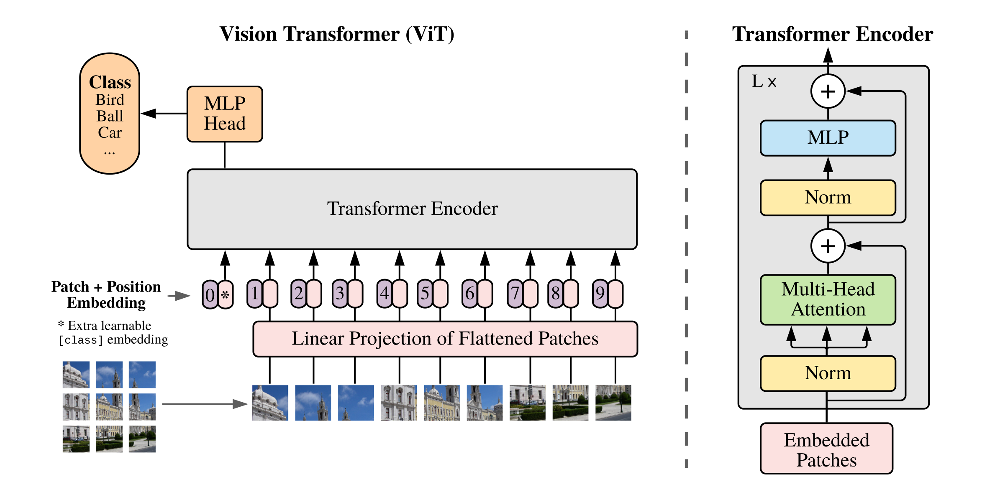
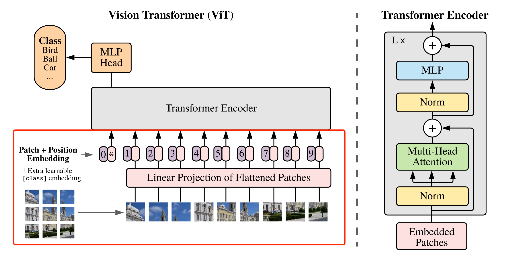

## ViT 论文

[An Image is Worth 16x16 Words: Transformers for Image Recognition at Scale](https://arxiv.org/abs/2010.11929)

## 介绍

在计算机视觉领域中，多数算法都是保持 CNN 整体结构不变，在 CNN 中增加 attention 模块或者使用 attention 模块替换 CNN 中的某些部分。研究者提出，没有必要总依赖于 CNN 。因此，作者提出 ViT ，仅仅使用 Transformer 结构也能够在图像分类任务中表现很好。

受到 NLP 领域中 Transformer 成功应用的启发，ViT 中尝试将标准的 Transformer 结构直接应用于图像，并对整个图像分类流程进行最少的修改。

具体来讲，**ViT 中，会将整幅图像拆分成小图像块，然后把这些小图像块的线性嵌入序列作为 Transformer 的输入送入网络**，然后使用监督学习的方式进行图像分类的训练。

## 模型结构

ViT 的整体结构如图下所示：



## image embedding patching

在 Transformer 结构中，输入是一个二维的矩阵，矩阵的形状可以表示为 $(N, D)$，其中 $N$ 是sequence 的长度，而 $D$ 是 sequence 中每个向量的维度。因此，在 ViT 中，首先需要将 $H \times W \times H$ 的三维图像转化为 $(N, D)$ 的二维输入。


VIT 的具体实现方式为：将 $H \times W \times C$ 的图像，变为一个 $N \times (P^2 \cdot C)$ 的序列。这个序列可以看做是一系列展开的图像块，也就是将图像切分成小块后，再将其展开。该序列中一共包含了 $N = \frac{HW}{P^2}$ 个图像块，每个图像块的维度则是 $(P^2 \cdot C)$。其中 $P$ 是图像块的大小，$C$ 是通道数量。经过上述变换，就可以将 $N$ 视为序列的长度了。

但是，此时每个图像块的维度是 $(P^2 \cdot C)$，而实际需要的向量维度是 $D$，因此还需要对图像块进行 **Embedding**。这里 Embedding 的方式非常简单，只需要对每个 $(P^2 \cdot C)$ 的图像块做一个线性变换，将维度压缩为 $D$ 即可。

上述对图像进行分块以及 Embedding 的具体方式如下图所示。



图像分块 Embedding 的具体代码实现如下。

```python
# 图像分块、Embedding
class PatchEmbed(nn.Layer):
    def __init__(self, img_size=224, patch_size=16, in_chans=3, embed_dim=768):
        super().__init__()
        # 原始大小为int，转为tuple，即：img_size原始输入224，变换后为[224,224]
        img_size = to_2tuple(img_size)
        patch_size = to_2tuple(patch_size)
        # 图像块的个数
        num_patches = (img_size[1] // patch_size[1]) * \
            (img_size[0] // patch_size[0])
        self.img_size = img_size
        self.patch_size = patch_size
        self.num_patches = num_patches
        # kernel_size=块大小，即每个块输出一个值，类似每个块展平后使用相同的全连接层进行处理
        # 输入维度为3，输出维度为块向量长度
        # 与原文中：分块、展平、全连接降维保持一致
        # 输出为[B, C, H, W]
        self.proj = nn.Conv2D(
            in_chans, embed_dim, kernel_size=patch_size, stride=patch_size)

    def forward(self, x):
        B, C, H, W = x.shape
        assert H == self.img_size[0] and W == self.img_size[1], \
            "Input image size ({H}*{W}) doesn't match model ({self.img_size[0]}*{self.img_size[1]})."
        # [B, C, H, W] -> [B, C, H*W] ->[B, H*W, C]
        x = self.proj(x).flatten(2).transpose((0, 2, 1))
        return x
```
