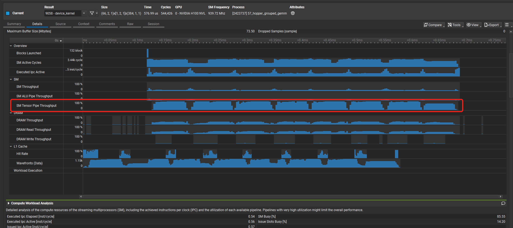

## Cooperative 和 Ping-pong 定义

Cooperative 和 Ping-pong 都是 Warp Specialization Persistent Kernel 的调度策略。

关于 Warp Specialization 这些调度策略 以及 Persistent 的概念。可以参考以下文档：

- <https://github.com/NVIDIA/cutlass/blob/main/media/docs/cpp/efficient_gemm.md>
- <https://github.com/NVIDIA/cutlass/issues/2181>
- [Deep Dive on CUTLASS Ping-Pong GEMM Kernel](https://pytorch.org/blog/cutlass-ping-pong-gemm-kernel/)

Cooperative 调度策略 和 Ping-pong 调度策略的区别：

- Cooperative 调度策略会让两个 Consumer Warp Group 计算同一个 Output Tile，一个 Warp Group 计算 Output Tile 的上半部分，另一个 Warp Group 计算 Output Tile 的下半部分。
- Ping-pong 调度策略，两个 Consumer Warp Group 则是分别计算不同的 Output Tile。

因此，如果为这两种调度策略设置同样大小的 Tile Shape，Ping-pong 调度策略的 Register Pressure 一定更大，因为它需要单个 Consumer Warp Group 来为整个 Output Tile 分配寄存器资源用于存储运算结果，而对于 Cooperative，单个 Consumer Warp Group 仅需为一半的 Output Tile 来分配寄存器。因此在很多 CUTLASS Examples 中，Ping-pong 的 Tile Shape 通常都是 Cooperative 的一半。

比如，[57_hopper_grouped_gemm](https://github.com/NVIDIA/cutlass/blob/main/examples/57_hopper_grouped_gemm/57_hopper_grouped_gemm.cu)

```cpp
// Different configs for pingpong/cooperative
struct CooperativeConfig {
  using KernelSchedule = cutlass::gemm::KernelPtrArrayTmaWarpSpecializedCooperativeFP8FastAccum;
  using EpilogueSchedule = cutlass::epilogue::PtrArrayTmaWarpSpecializedCooperative;
  using TileShape           = Shape<_256,_128,_128>;
  using ClusterShape        = Shape<_1,_2,_1>;
};

struct PingpongConfig {
  using KernelSchedule = cutlass::gemm::KernelPtrArrayTmaWarpSpecializedPingpongFP8FastAccum;
  using EpilogueSchedule = cutlass::epilogue::PtrArrayTmaWarpSpecializedPingpong;
  using TileShape           = Shape<_128,_128,_128>;
  using ClusterShape        = Shape<_2,_1,_1>;
};
```

显然，Ping-pong 调度策略的 Output Tile 仅有 Cooperative 调度策略的一半大小。

在 NVIDIA GPU 上，对于 GEMM 类的 Compute-bound 算子，性能优化的目标通常是**需要程序可以持续地、饱和地利用所有 SM Core 上的 Tensor Core 运算单元**。在 CUTLASS GEMM Kernel 中，Mainloop 阶段主要利用的是 Tensor Core 运算单元，而 Epilogue 阶段则是完成一些额外的计算操作（例如实施激活函数）并将结果写回 Global Memory，这些操作只依赖于 Cuda Core，不依赖于 Tensor Core。因此，结合性能优化的目标，希望在整个 Kernel 的生命周期中尽可能的使用 Mainloop 掩盖 Epilogue 的开销，避免将 Epilogue 直接暴露在 Timeline 上，以最大化 Tensor Core 的利用率。


教学视频：[CUTLASS 2.x 与 3.x 的入门使用](https://www.bilibili.com/video/BV1XH4y1c7JZ?spm_id_from=333.788.videopod.sections&vd_source=3187e54ee4327cdd9b00a232b8ccb71c)


从上图的 cooperative 示例可以看到，绿色的是 prologue TMA 加载数据，蓝色的就是 TC，灰色部分代表 Epilogue， 可以看到使用 Cooperative 调度策略时，Epilogue 部分是暴露在 Timeline 上的。

相比之下，使用 Ping-pong 调度策略时，Epilogue 部分则是完全被 Mainloop 部分 Overlap 掉了，如下图所示：


上面的两张图片只是理想情况下的简单示例。接下来看一看真实 Kernel 的 Timeline 是否和上图具有一致的现象，此时我们需要利用 ncu 的一个新特性——[PM Sampling](https://docs.nvidia.com/nsight-compute/ProfilingGuide/index.html#pm-sampling)。

按照如下配置分别运行使用 Cooperative 调度策略和 Ping-pong 调度策略的 Hopper Grouped GEMM：

```bash
num_groups = 256
M = 128
N = 512
K = 7168
```

观察 Cooperative Kernel 的 PM Sampling Timeline：



可以看到，Tensor Pipe Throughput 出现了非常明显的周期性下降的现象，在 Timeline 上形成了一些“缺口”。如果我们仔细的去数一数这些“缺口”的数量，可以发现这些“缺口”共有 7 个。因为使用的是 **H100 GPU（有 132 个 SM Core）**，并且 Cooperative 调度策略使用的 Tile Shape 为 (128, 128, 128)，因此我们可以推算每个 CTA 需要计算的 Output Tile 的数量：

```bash
>>> num_groups = 256 
>>> M = 128
>>> N = 512
>>> TileShapeM = 128 
>>> TileShapeN = 128 
>>> CTAs = 132
>> num_groups * ((M / TileShapeM) * (N / TileShapeN)) / CTAs 
7.757575757575758
```

显然，多数 CTA 需要计算 7 个 Output Tile，在 Warp Specialization Persistent Kernel 中，每个 SM Core 只调度一个 CTA，因此 SM Core 上的运行状况就是单个 CTA 的运行状况。7 个缺口恰好对应了前 7 个 Output Tile 的 Epilogue 阶段。相比之下，Ping-pong 调度策略的 PM Sampling Timeline 显示 Tensor Pipe Throughput 始终处于一个相对稳定的水平，不会出现明显的“缺口”现象：


## 分析 Cooperative 无法 Overlap Epilogue 的原因

猜测，只有在两个 Consumer Warp Group 都完成了 Mainloop 后，才可以安全的发起 Epilogue 操作，这一定需要同步两个 Consumer Warp Group。然后这里的同步操作，会导致 Epilogue 无法被 Overlap。

阅读 CUTLASS 代码，发现并不是。运行完 Mainloop 后，就开始执行 Epilogue 了，没有同步操作。

[Cooperative 代码](https://github.com/NVIDIA/cutlass/blob/a1aaf2300a8fc3a8106a05436e1a2abad0930443/include/cutlass/gemm/kernel/sm90_gemm_tma_warpspecialized_cooperative.hpp#L770)

```cpp
if (TileScheduler::valid_warpgroup_in_work_tile(work_tile_info)) {
  collective_mainloop.mma(
    mainloop_pipeline,
    mainloop_pipe_consumer_state,
    accumulators,
    work_k_tile_count,
    mma_thread_idx,
    shared_storage.tensors.mainloop,
    params.mainloop
  );

  // Make sure the math instructions are done and free buffers before entering the epilogue
  collective_mainloop.mma_tail(
    mainloop_pipeline,
    mainloop_pipe_consumer_state,
    work_k_tile_count
  );

  // Update starting mainloop pipeline state for the next tile
  mainloop_pipe_consumer_state.advance(work_k_tile_count);
}
#ifdef CUTLASS_ENABLE_GDC_FOR_SM90
if (scheduler.is_last_tile(work_tile_info)) {
  // Hint on an early release of global memory resources.
  // The timing of calling this function only influences performance,
  // not functional correctness.
  cutlass::arch::launch_dependent_grids();

}
#endif

// Index of warp group within consumer warp groups
int consumer_warp_group_idx = canonical_warp_group_idx() - NumLoadWarpGroups;

// Perform reduction across splits, if needed
TileScheduler::fixup(
  params.scheduler, work_tile_info, accumulators, NumMmaWarpGroups, consumer_warp_group_idx);

if (TileScheduler::compute_epilogue(work_tile_info, params.scheduler)) {
  // Epilogue and write to gD
  auto [epi_load_pipe_consumer_state_next, epi_store_pipe_producer_state_next] =
  collective_epilogue.store(
    epi_load_pipeline,
    epi_load_pipe_consumer_state,
    epi_store_pipeline,
    epi_store_pipe_producer_state,
    problem_shape_MNKL,
    blk_shape,
    blk_coord,
    accumulators,
    tiled_mma,
    mma_thread_idx,
    shared_storage.tensors.epilogue,
    work_tile_info.reduction_subtile_idx()
  );
  epi_load_pipe_consumer_state = epi_load_pipe_consumer_state_next;
  epi_store_pipe_producer_state = epi_store_pipe_producer_state_next;
  do_store_tail = true;
}
```

阅读 CUTLASS issue：

[Why we have both Ping-pong and Cooperative schedule?](https://github.com/NVIDIA/cutlass/issues/2181)

有人提到，对于 Cooperative Kernel 来说，Producer Warp Group 每次进行数据拷贝时，是利用单个 TMA 请求为两个 Consumer Warp Group 拷贝一整块的数据，只要拿到数据，两个 Warp Group 就会同时开始工作，在 Cooperative Kernel 中，并未对这两个 Warp Group 的执行顺序进行任何限制，而是放任它们以一种"竞争"的姿态争抢 Tensor Core 资源完成计算。**通常，对于两个 Warp Group 来说，这种竞争都是一种"势均力敌"的状态，一般不会出现一个 Warp Group 的执行进度显著的领先于另一个 Warp Group 的情况。因此无法有效的 Overlap 掉 Epilogue。**

而且，有限的 StageCount 也会将 Warp Group 执行进度的差异控制在 StageCount 以内，因为两个 Warp Group 依赖于相同的数据，即使一个 Warp Group 很早地完成了自己的 StageCount 个计算任务，也必须要等待另一个 Warp Group 也完成 StageCount 个计算任务，才可以释放 Shared Memory Buffer 允许 Producer Warp Group 填充新的数据。因此，**两个 Warp Group 在 Mainloop 阶段的执行进度不会有太大的差异，即使有差异，最大也不会超过流水线级数 StageCount，结束 Mainloop 执行的时刻也是相近的，显然，这样肯定是无法有效的 Overlap 掉 Epilogue 的**。

在此基础上，可以和 Ping-pong 调度策略进行对比，在 Ping-pong 调度策略中，由于两个 Consumer Warp Group 负责计算不同的 Output Tile，因此它们的输入数据也是完全独立的，对于任意一个 Consumer Warp Group，只要它的输入数据消费完毕，Shared Memory Buffer 就可以立即释放，并不会受到另一个 Consumer Warp Group 的影响。

显然，此时两个 Warp Group 可以以任意的顺序执行，但是为了避免出现 Cooperative 中那种"势均力敌"的情况导致 Epilogue 无法被有效的 Overlap，Ping-pong 调度策略引入了 Ordered Sequence Barrier 用于强制约束两个 Warp Group 的执行顺序：

[Ping-pong 代码](https://github.com/NVIDIA/cutlass/blob/a1aaf2300a8fc3a8106a05436e1a2abad0930443/include/cutlass/gemm/kernel/sm90_gemm_tma_warpspecialized_pingpong.hpp#L845)

从以下 Ping-pong 代码中可以观察到，Ordered Sequence Barrier 的 wait 和 arrive 强制一个 Warp Group 完成自己的 Mainloop 后，另一个 Warp Group 才可以执行自己的 Mainloop。两 个Warp Group 的 Mainloop 执行阶段是完全错开的，因此可以用一个 Warp Group 的 Mainloop 执行阶段 Overlap 另一个 Warp Group 的 Epilogue。

```cpp
// Allocate the accumulators for the (M,N) blk_shape
Tensor accumulators = partition_fragment_C(tiled_mma, take<0,2>(blk_shape));               // (MMA,MMA_M,MMA_N)

// Order two Math WG's MMA one after the other, helps hide Epilogue
math_wg_order_barrier.wait();

collective_mainloop.mma(
  mainloop_pipeline,
  mainloop_pipe_consumer_state,
  accumulators,
  k_tile_count,
  warp_group_thread_idx,
  shared_storage.tensors.mainloop,
  params.mainloop
);

// Cue for next Math WG's MMA to start
math_wg_order_barrier.arrive();

// Make sure the math instructions are done and free buffers before entering the epilogue
collective_mainloop.mma_tail(
  mainloop_pipeline,
  mainloop_pipe_consumer_state,
  k_tile_count
);
// Update starting mainloop pipeline state for the next tile
mainloop_pipe_consumer_state.advance(k_tile_count * NumMmaWarpGroups);
```

## 总结

在 H100 环境下压测过，跑大部分 shape 场景，Ping-pong scheduler 会比 Cooperative scheduler 稍微快一点。

主要原因：

- Ping-pong 调度策略通过 Ordered Sequence Barrier 严格的约束了两个 Consumer Warp Group 的执行顺序，让两个 Consumer Warp Group 交错执行 Mainloop 和 Epilogue，有效的 Overlap 掉了 Epilogue 的开销。
- Cooperative 中的两个 Consumer Warp Group 依赖于同样的数据，在数据到达后以一种"竞争"的模式使用 Tensor Core 计算资源，在“势均力敌”的情况下，Mainloop 的执行结束时间相接近，导致 Epilogue 不能够被有效的 Overlap。

官方提供的数据如下，感觉差不多：


FP32 Accu 的 Hopper GEMM benchmark：


FP16 Accu 的 Hopper GEMM benchmark：


以上图片来自教学视频：[CUTLASS 2.x 与 3.x 的入门使用](https://www.bilibili.com/video/BV1XH4y1c7JZ?spm_id_from=333.788.videopod.sections&vd_source=3187e54ee4327cdd9b00a232b8ccb71c)