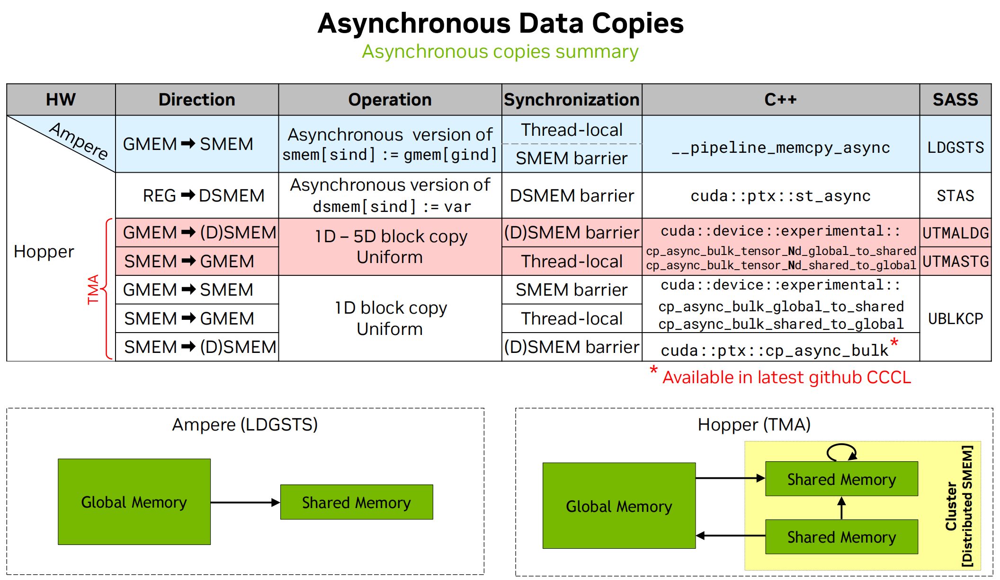
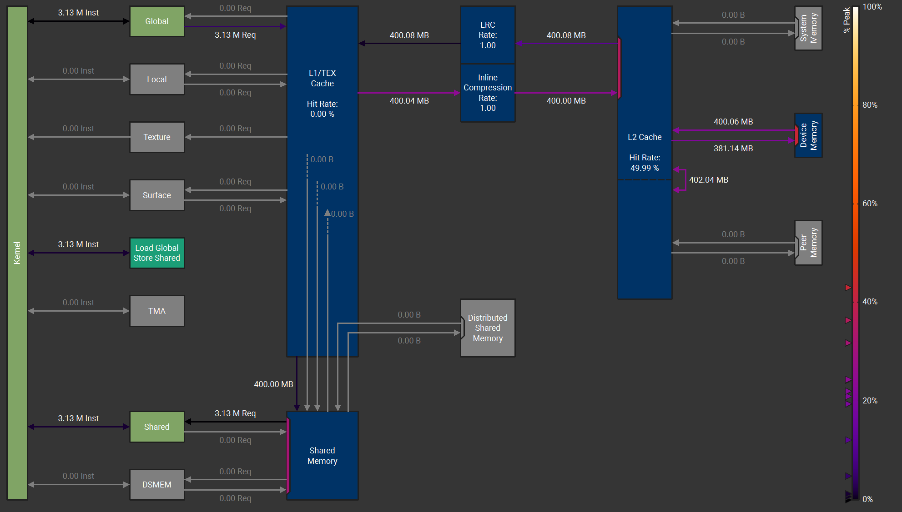
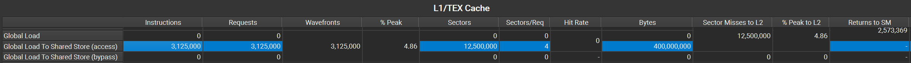
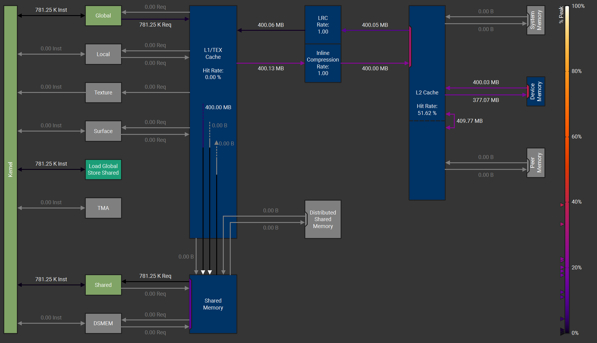
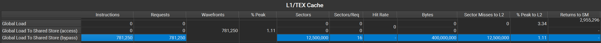

# cp.async系列

cp.async 指令是 Ampere 架构引入的一种异步数据拷贝的指令，并在 Hopper 架构上进行了拓展。

当需要把数据从全局内存拷贝到共享内存中时，同步的数据加载命令需要先把数据从全局内存读取到寄存器中，然后在从寄存器保存到共享内存中。这样不仅会增加寄存器压力，还会浪费L1带宽，而且由于全局内存延迟较高，导致从全局内存到寄存器需要较多的时间。

使用 cp.async 指令可以异步的把数据从全局内存加载到共享内存中，不需要经过寄存器，从而可以让更多的寄存器参与计算。而且由于是异步拷贝，当需要计算时，数据已经加载到共享内存中了，可以减少等待数据访问的时间。

如下图所示，cp.async 对应下面几种访问模式。在 ampere 架构上，cp.async 只支持从全局内存异步的加载数据到共享内存。在 Hopper 架构上，由于Tensor Memory Accelerate（TMA）的存在，cp.async 可以支持 1-5D 的 tensor 数据从全局内存异步的拷贝到共享内存或分布式共享内存，也支持从共享内存异步的拷贝到全局内存，以及一个 block cluster 中共享内存间的拷贝。



cp.async 有两种类型，cp.async 和 cp.async.bulk。不带 bulk 的就是能在 Ampere 架构上使用的指令，只能从全局内存拷贝到共享内存，一次拷贝的字节数为 4，8 或 16。带 bulk 的指令可以在 Hopper 架构上使用，可以使用 TMA 一次拷贝大量数据。当使用带 bulk 的指令时，数据量必须是 16 bytes 的倍数。Hopper 架构也可以使用 cp.async，但是 Ampere 架构不能使用 cp.async.bulk。

一个异步数据传输操作主要由下面几步组成：
1. 从 src 读数据。
2. 写数据到 dst。
3. 结果让当前线程或其他线程可见。

由于拷贝是异步的，所以需要某种方法来确定拷贝是否完成。在 PTX 中有两种异步拷贝操作完成机制：async-group mechanism 和 mbarrier-based mechanism。

## Async-group mechanism

当使用异步组（async-group mechanism）机制时，发射异步拷贝指令的线程使用 commit 操作指定一个异步操作组，称为 async-group。使用 wait 操作跟踪这个 group 是否完成。其中 bulk 和 non-bulk 需要创建不同的 async-groups。

commit 操作会把前面所有还没有被提交的异步操作提交到一个 async-group 中。当一个 async-group 完成时，说明该 async-group 中的所有异步操作均已完成。不同的 group 会按照提交的顺序来完成，一个 group 中的异步操作没有明确的顺序。

使用 async-group 的流程如下：
1. 初始化一个异步操作。
2. 使用 commit 把异步操作提交到 async-group 中。
3. 使用 wait 等待 group 中的操作完成。
4. group 完成后访问 group 的结果。

## Mbarrier-based mechanism

mbarrier 是一个在共享内存中的对象，详见 mbarrier。一个线程可以通过 mbarrier 的状态来确定一个或多个异步操作是否完成。当 mbarrier 的当前状态完成后，所有被当前状态跟踪的异步操作均已完成，并且所有参与 mbarrier 的线程可以访问异步操作的结果。

使用流程如下：
1. 初始化一个异步操作
2. 设置一个 mbarrier 对象来跟踪其当前阶段的异步操作。mbarrier 对象可以作为异步操作的一部分，也可以作为单独的操作。
3. 使用 mbarrier.test_wait 或 mbarrier.try_wait 等待 mbarrier 对象完成其当前阶段。
4. 一旦 mbarrier.test_wait 或 mbarrier.try_wait 操作返回 True，即可访问 mbarrier 对象跟踪的异步操作的结果。

## Asynchronous proxy

在 CUDA 中，不同的内存访问方式称为内存代理 (memory proxy)，简称 proxy。当两个内存操作使用不同的内存访问方式时，就称为使用不同的 proxy。

普通的内存访问方式称为generic proxy，cp{.reduce}.async.bulk 操作由于使用TMA来访问数据，因此属于异步代理 (asynchronous proxy)。
跨多个代理访问同一内存位置需要 cross-proxy fence。对于异步代理，应使用 fence.proxy.async 来同步通用代理 (generic proxy) 和异步代理(async proxy) 之间的内存。

cp{.reduce}.async.bulk 操作完成后，会有一个隐式的generic-async proxy fence。因此，一旦异步操作完成，其结果就会对通用代理可见。

必须使用 async-group 或基于 mbarrier 的完成机制来等待 cp{.reduce}.async.bulk 指令完成。

## Non-bulk copy

### cp.async

启动一个异步拷贝操作从全局内存异步拷贝数据到共享内存中。

ptx指令使用方式如下：
```cpp
cp.async.ca.shared{::cta}.global{.level::cache_hint}{.level::prefetch_size}
                         [dst], [src], cp-size{, src-size}{, cache-policy} ;
cp.async.cg.shared{::cta}.global{.level::cache_hint}{.level::prefetch_size}
                         [dst], [src], 16{, src-size}{, cache-policy} ;
cp.async.ca.shared{::cta}.global{.level::cache_hint}{.level::prefetch_size}
                         [dst], [src], cp-size{, ignore-src}{, cache-policy} ;
cp.async.cg.shared{::cta}.global{.level::cache_hint}{.level::prefetch_size}
                         [dst], [src], 16{, ignore-src}{, cache-policy} ;

.level::cache_hint =     { .L2::cache_hint }
.level::prefetch_size =  { .L2::64B, .L2::128B, .L2::256B }
cp-size =                { 4, 8, 16 }
```

cp.async 是一条非阻塞指令，它启动一个异步数据复制操作，将数据从源地址 src 指定的位置复制到目标地址 dst 指定的位置。这里源地址 src 位于全局内存，目标地址 dst 位于共享内存。

.ca 和 .cg 用于表明复制时缓存的使用情况。.ca 限定符表示从全局内存复制时会在 L1 和 L2 缓存上缓存数据。.cg 限定符表示仅在二级缓存（L2）而非一级缓存（L1）缓存数据。

cp-size 是一个整型常量，指定要复制到目标 dst 的数据大小（以字节为单位）。cp-size 只能为 4、8 和 16。当使用 .ca 时，cp-size可以设置为4，8，16。当使用 .cg 时 cp-size 只能是 16。

可选限定符 .level::cache_hint 用于指定缓存策略。.level::prefetch_size 限定符用于提示将指定大小的额外数据提取到相应的缓存级别。子限定符 prefetch_size 可以设置为 64B、128B 或 256B，从而分别允许预取大小为 64 字节、128 字节或 256 字节。

cp.async 指令可以指定一个 32 位整型操作数 src-size，表示要从 src 复制到 dst 的数据大小（以字节为单位），并且必须小于 cp-size。在这种情况下，目标 dst 中的剩余字节将用零填充。

可选的参数 ignore-src 指定是否完全忽略来自 src 的数据。如果忽略源数据，则将零复制到目标 dst。如果未指定参数 ignore-src，则默认为 False。

```cpp
cp.async.ca.shared.global  [shrd],    [gbl + 4], 4;
cp.async.ca.shared::cta.global  [%r0 + 8], [%r1],     8;
cp.async.cg.shared.global  [%r2],     [%r3],     16;

cp.async.cg.shared.global.L2::64B   [%r2],      [%r3],     16;
cp.async.cg.shared.global.L2::128B  [%r0 + 16], [%r1],     16;
cp.async.cg.shared.global.L2::256B  [%r2 + 32], [%r3],     16;

createpolicy.fractional.L2::evict_last.L2::evict_unchanged.b64 cache-policy, 0.25;
cp.async.ca.shared.global.L2::cache_hint [%r2], [%r1], 4, cache-policy;

cp.async.ca.shared.global                   [shrd], [gbl], 4, p;
cp.async.cg.shared.global.L2::cache_hint   [%r0], [%r2], 16, q, cache-policy;
```

### cp.async.commit_group

将所有先前启动但未提交的 cp.async 指令提交到 cp.async-group 中。

```cpp
cp.async.commit_group ;
```

cp.async.commit_group 指令会为每个线程创建一个新的 cp.async-group，并将所有由执行线程发起但尚未提交给任何 cp.async-group的 cp.async 指令批量添加到新的 cp.async-group 中。如果没有未提交的 cp.async 指令，则 cp.async.commit_group 会返回一个空的 cp.async-group。

执行线程可以使用 cp.async.wait_group 等待 cp.async-group 中所有 cp.async 操作完成。同一 cp.async-group 中任意两个 cp.async 操作之间不提供内存顺序保证。

```cpp
// Example 1:
cp.async.ca.shared.global [shrd], [gbl], 4;
cp.async.commit_group ; // Marks the end of a cp.async group

// Example 2:
cp.async.ca.shared.global [shrd1],   [gbl1],   8;
cp.async.ca.shared.global [shrd1+8], [gbl1+8], 8;
cp.async.commit_group ; // Marks the end of cp.async group 1

cp.async.ca.shared.global [shrd2],    [gbl2],    16;
cp.async.cg.shared.global [shrd2+16], [gbl2+16], 16;
cp.async.commit_group ; // Marks the end of cp.async group 2
```

### cp.async.wait_group, cp.async.wait_all

等待前面的异步拷贝操作完成

```cpp
cp.async.wait_group N;
cp.async.wait_all ;
```

cp.async.wait_group 指令将使执行线程等待，直到最近的 cp.async-groups 中只有 N 个或更少的 cp.async-groups 处于运行状态。例如，当 N = 1 时，该线程允许最近的 1 个 group 正在运行，其余 group 均已完成。当 N 为 0 时，执行线程将等待所有先前的 cp.async-groups 完成。操作数 N 是一个整数常量。

cp.async.wait_all 等效于以下操作：  

```cpp
cp.async.commit_group;
cp.async.wait_group 0;
```

cp.async 操作执行的写入操作仅在以下情况后对执行线程可见：
1. cp.async.wait_all 完成，或
2. cp.async 所属的 cp.async-group 上的 cp.async.wait_group 完成，或
3. mbarrier.test_wait 在跟踪 cp.async 操作完成情况的 mbarrier 对象上返回 True。

两个未与 cp.async.wait_all 或 cp.async.wait_group 或 mbarrier 对象同步的 cp.async 操作之间没有顺序。
cp.async.wait_group 和 cp.async.wait_all 仅为 cp.async 内存操作提供顺序和可见性保证。 

```cpp
// Example of .wait_all:
cp.async.ca.shared.global [shrd1], [gbl1], 4;
cp.async.cg.shared.global [shrd2], [gbl2], 16;
cp.async.wait_all;  // waits for all prior cp.async to complete

// Example of .wait_group :
cp.async.ca.shared.global [shrd3], [gbl3], 8;
cp.async.commit_group;  // End of group 1

cp.async.cg.shared.global [shrd4], [gbl4], 16;
cp.async.commit_group;  // End of group 2

cp.async.cg.shared.global [shrd5], [gbl5], 16;
cp.async.commit_group;  // End of group 3

cp.async.wait_group 1;  // waits for group 1 and group 2 to complete
```

在 cutlass 中 sm80 的 cp.async 一共有 4 种实现，分别是 SM80_CP_ASYNC_CACHEALWAYS，SM80_CP_ASYNC_CACHEGLOBAL，SM80_CP_ASYNC_CACHEALWAYS_ZFILL 和 SM80_CP_ASYNC_CACHEGLOBAL_ZFILL。

其中带 ZFILL 的是可以填充 0，CACHEALWAYS 表示缓存在 L1 和 L2 cache，也就是.ca，CACHEGLOBAL 表示只缓存在 L2 cache，也就是.cg。

前面提到 cp-size 只能是 4、8 和 16，而且cache缓存有 .ca 和 .cg 两种形式，所以 cutlass 对这两种复制方式加了 assert，CACHEALWAYS 版本的 cp-size 可以是 4，8 和 16。CACHEGLOBAL 的 cp-size 只能是 16。如果 cp-size 是 4 或 8 时使用 cg 会报错：'cp.async': unexpected value '4', expected to be 16。

```cpp
__global__ void cp_async_size4(float *src, float *dst, int N)
{
    int tid = threadIdx.x;
    int index = blockIdx.x * blockDim.x + tid;

    extern __shared__ float smem[];

    float *gmem_ptr = src + index;
    uint32_t smem_int_ptr = static_cast<uint32_t>(__cvta_generic_to_shared(smem + tid));

    asm volatile("cp.async.ca.shared.global.L2::128B [%0], [%1], %2;\n" ::"r"(smem_int_ptr),
                 "l"(gmem_ptr),
                 "n"(sizeof(float)));

    asm volatile("cp.async.commit_group;\n" ::);
    asm volatile("cp.async.wait_all;\n" ::);

    dst[index] = smem[tid];
}

__global__ void cp_async_size16(float *src, float *dst, int N)
{
    int tid = threadIdx.x;
    int index = blockIdx.x * blockDim.x * 4;

    extern __shared__ float smem[];

    float *gmem_ptr = src + index + tid * 4;
    uint32_t smem_int_ptr = static_cast<uint32_t>(__cvta_generic_to_shared(reinterpret_cast<float4 *>(smem) + tid));

    asm volatile("cp.async.cg.shared.global.L2::128B [%0], [%1], %2;\n" ::"r"(smem_int_ptr),
                 "l"(gmem_ptr),
                 "n"(sizeof(float4)));

    asm volatile("cp.async.commit_group;\n" ::);
    asm volatile("cp.async.wait_all;\n" ::);

    reinterpret_cast<float4 *>(dst + index)[tid] = reinterpret_cast<float4 *>(smem)[tid];
}

int main()
{
    srand(1234);

    int N = 1e8;

    thrust::host_vector<float> h_S(N);
    thrust::host_vector<float> h_D(N);
    thrust::host_vector<float> copy_result(N);

    for (int i = 0; i < N; ++i)
    {
        h_S[i] = static_cast<float>(rand() % 9 + 1);
    }

    thrust::device_vector<float> d_S = h_S;
    thrust::device_vector<float> d_D = h_D;

    constexpr int threads = 256;
    int blocks = (N + threads - 1) / threads;

    cp_async_size4<<<blocks, threads, threads * sizeof(float)>>>(d_S.data().get(), d_D.data().get(), N);
    cp_async_size16<<<blocks, threads, threads * sizeof(float4)>>>(d_S.data().get(), d_D.data().get(), N);
    copy_result = d_D;
    test_copy(h_S.data(), copy_result.data(), N);

    return 0;
}
```

### Profile
#### cp-size 4

使用 cp-size = 4 复制 1e8 个 float 数据。





从图上可以看到从 global 到 smem 是经过了 L1 的，此时使用的 SASS 指令是 LDGSTS.E.LTC128B。

#### cp-size 16

使用 cp-size = 16 复制 1e8 个 float 数据。





从图上可以看到，从 global 到 smem 没有经过 L1，此时使用的 SASS 指令是 LDGSTS.E.BYPASS.LTC128B.128。

## Bulk-copy (TMA)

### cp.async.bulk

## Tensor copy (TMA Tensor)

### cp.async.bulk.tensor

## TMA Swizzle

## Bulk and Tensor copy completion instructions

### cp.async.bulk.commit_group

### cp.async.bulk.wait_group

