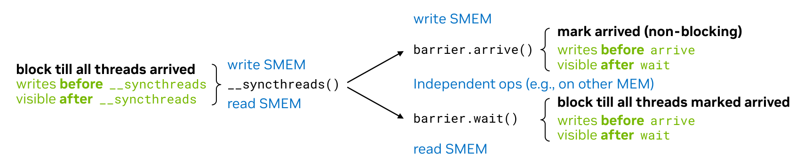
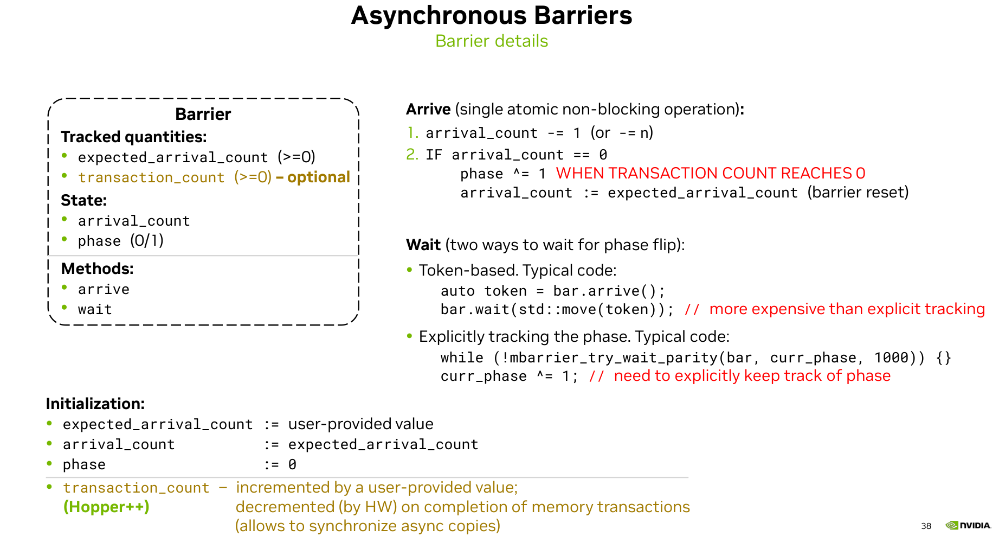
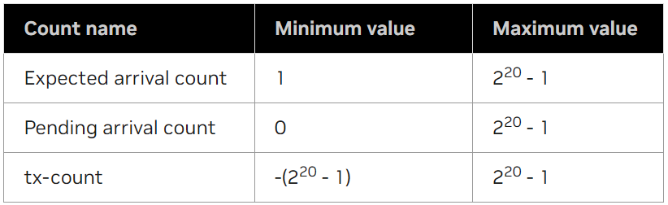

# Asynchronous Barriers
一般thread block中线程的同步是通过`__syncthreads()`进行的。一个线程运行到`__syncthreads()`时必须要等待其他线程到达才能执行后续代码，在等待时线程不能干别的事情。
barrier等于是通过`barrier.arrive()`和`barrier.wait()`把`__syncthreads()`拆开了。线程到达arrive后可以干别的独立的事情，干完之后再通过wait确保与其他线程的同步。


在PTX中有多种barrier指令，如`bar`，`barrier`和`mbarrier`等。本文中主要介绍`mbarrier`。

mbarrier是一个共享内存上的64位变量，由expected_arrival_count，transcation_count，arrival_count和phase组成，函数有arrive和wait。
其中expected_arrival_count表示有多少线程会参与到mbarrier中，这个值由用户提供。transcation_count是一个可选的变量，在Hopper的异步拷贝中可以用到。

barrier在初始化时会根据用户提供的value初始化expected_arrival_count，然后把arrival_count也初始化成这个value。phase设成0。transcation_count如果有的话是根据异步拷贝的数据量设置的。

当一个线程到达arrive函数后，arrival_count会减1，表示已经有一个线程到达了。当所有的参与线程都到达了arrive函数，arrival_count就会变成0。当arrival_count变成0时，表示所有的线程都到达了，此时phase状态会切换，arrival_count会重新被设置为expected_arrival_count。
如果设置了transcation_count则mbarrier会等待transcation_count和arrival_count同时归零后切换phase。

有两种方法等待wait函数切换状态，一种时基于token，arrive()会返回一个token，然后把token传到wait函数中去。这种方法比第二种更重，具体是怎么实现的呢。

第二种方法是显示的跟踪phase，通过try_wait_parity函数，传进去一个cur_phase，当try_wait函数返回true时，cur_phase切换状态。
也就是说所有的线程到达arrive后barrier的状态已经切换了，然后每个线程各干各的，wait就直接返回为true了。
或者部分线程先到达arrive，但是状态没切换，然后这部分线程到达了wait，就一直在等待。等到其他线程到达arrive，且状态切换后wait就等待完成。
只需要一个线程就可以初始化，如果多个线程进行初始化，transcation_count会进行累加。


## mbarrier
mbarrier是创建在共享内存中的对象，支持以下功能：
1. 在CTA内对线程或线程子集进行同步。
2. 在CTA cluster中对线程执行单向同步操作。线程只能对位于shared::cluster空间的mbarrier执行arrive操作，不能执行*_wait操作。
3. 等待线程发起的异步内存操作完成，并使其对其他线程可见。
mbarrier可以通过mbarrier.init进行初始化，也可以通过mbarrier.inval设置为无效。
mbarrier支持下面的操作，在调用这些方法前，必须要先对mbarrier进行初始化。
```cpp
mbarrier.expect_tx
mbarrier.complete_tx
mbarrier.arrive
mbarrier.arrive_drop
mbarrier.test_wait
mbarrier.try_wait
mbarrier.pending_count
cp.async.mbarrier.arrive
```
与bar或barrier指令（每个CTA只能访问有限数量的barriers）不同，mbarrier对象由用户定义，仅受到可用的共享内存总大小的限制。
通过mbarrier，线程可以在到达arrive后进行其他的工作，然后通过wait对之前的工作进行同步。
mbarrier是一个64位的共享内存变量，需要8字节对齐。
mbarrier对象中包含下面的信息：
1. 当前mbarrier的状态phase。
2. mbarrier当前状态还未到达的线程数。
3. mbarrier下一个状态预期到达的线程数。
4. mbarrier当前状态还未到达的内存传输字节数tx-count。
mbarrier 对象会经历一系列阶段phase，其中每个phase由执行预期数量的到达操作的线程定义。
每个变量的有效范围如下：

在这里注意到tx-count的取值范围是-(2^20-1)到(2^20-1)。这说明可以先进行异步拷贝，然后再设置expect-tx。
```cpp
int tx_bytes = 100;
tma_load_1d(tma_buffer, src_addr, tma_mbarrier, tx_bytes);
mbarrier_arrive_and_expect_tx(tma_mbarrier, tx_bytes);
mbarrier_wait(tma_mbarrier, tma_phase);
```
比如上面这段代码，tx_bytes是100，代码中先进行了tma异步拷贝。传输完成后，tma_mbarrier中的tx-count变为了-100。然后执行arrive.expect_tx操作，这个操作会先设置expect_tx，然后再执行arrive。所以此时tma_mbarrier中的tx-count会加上100，变成0，然后执行arrive-on。

mbarrier的phase记录了mbarrier已经进行了几次同步操作。在每一个phase中，threads首先通过arrive-on来完成当前phase，然后通过test_wait或try_wait等待其他线程完成当前阶段。
一旦当前阶段完成，mbarrier会自动重新初始化来用于下一个阶段。
从 Hopper 架构开始，mbarrier 支持一种名为 tx-count 的新计数方式，用于跟踪异步内存操作的完成情况。
mbarrier 的 tx-count 必须设置为当前阶段要跟踪的异步内存操作总bytes数。每个异步操作完成后，都会对 mbarrier 对象执行 complete-tx 操作，从而使 mbarrier 的状态进行切换。
expect-tx 操作带有一个 expectCount 参数，它会将 mbarrier 的 tx-count 增加 expectCount 指定的值。这使得 mbarrier 对象的当前阶段能够预期并跟踪其他异步事务的完成情况。
mbarrier 上的 complete-tx 操作带有 completeCount 参数，包括以下内容：
1. mbarrier 信号。表示当前阶段跟踪的异步事务已完成。因此，tx-count 将减少 completeCount。
2. mbarrier 可能正在完成当前阶段。如果当前阶段已完成，则 mbarrier 将转换到下一个阶段。
完成当前阶段的要求如下所述。当前阶段完成后，阶段将转换到后续阶段，如下所述。
当前阶段完成要求，当满足以下所有条件时，mbarrier 对象完成当前阶段：
1. 待处理到达计数已达到零。
2. 事务计数已达到零。
阶段转换，当 mbarrier 对象完成当前阶段时，将以原子方式执行以下操作：
1. mbarrier 对象转换到下一阶段。
2. 待处理到达计数将重新初始化为预期到达计数。

mbarrier 对象上的arrive-on 操作（带有可选的 count 参数）包含以下两个步骤：
mbarrier 信号发送：发送执行线程到达的信号，或发送 cp.async 指令的完成信号（cp.async 指令表示由执行线程在 mbarrier 对象上发起的到达操作）。因此，待处理的到达计数将减少 count。如果未指定 count 参数，则默认为 1。
mbarrier 可能完成当前阶段：如果当前阶段已完成，则 mbarrier 将转换到下一个阶段。

## mbarrier.init
初始化一个mbarrier对象。
```cpp
mbarrier.init{.shared{::cta}}.b64 [addr], count;
```
mbarrier.init 使用无符号 32 位整数 count 在 addr 指定的位置初始化 mbarrier 对象。操作数 count 的值必须在 1-2^20-1之间。
mbarrier对象的初始化包括：
1. 把current phase设为0.
2. 把expected arrival count设为 count。
3. 把pending arrival count设为 count。
4. 把tx-count设为0。tx-count是异步拷贝时传输的bytes数，只有在异步拷贝时才用到。
addr对象需要64位，8字节对齐。
在包含有效 mbarrier 对象的内存位置上执行 mbarrier.init 操作的行为是未定义的；首先使用 mbarrier.inval 使 mbarrier 对象无效，然后再将内存位置重新用于任何其他目的，包括另一个 mbarrier 对象。
举例：
```cpp
.shared .b64 shMem, shMem2;
.reg    .b64 addr;
.reg    .b32 %r1;

cvta.shared.u64          addr, shMem2;
mbarrier.init.b64        [addr],   %r1;
bar.cta.sync             0;
// ... other mbarrier operations on addr

mbarrier.init.shared::cta.b64 [shMem], 12;
bar.sync                 0;
// ... other mbarrier operations on shMem
```
```cpp
__global__ void cp_async_bulk(float *src, float *dst, int N)
{
    int tid = threadIdx.x;
    int index = blockIdx.x * blockDim.x;

    __shared__ uint64_t bar[1];
    bar[0] = 0;
    uint32_t smem_int_mbar = cast_smem_ptr_to_uint(bar);

    if (tid == 0)
    {
        /// Initialize shared memory barrier
        asm volatile("mbarrier.init.shared::cta.b64 [%0], %1;\n" ::"r"(smem_int_mbar),
                     "r"(blockDim.x));
    }
    __syncthreads();
    ...
}
```
## mbarrier.inval
把 mbarrier 对象设为无效。
```cpp
mbarrier.inval{.shared{::cta}}.b64 [addr];
```
mbarrier.inval 会使 addr 指定位置的 mbarrier 对象失效。在将 mbarrier 对象的内存位置用于任何其他用途之前，必须先使其失效。
在不包含有效 mbarrier 对象的内存位置执行除 mbarrier.init 之外的任何 mbarrier 操作都会导致未定义的行为。

## mbarrier.expect_tx
对mbarrier对象执行expect-tx操作。expect-tx 操作就是把mbarrier中的tx-count增加txCount。
设置tx-count，也就是一个phase中异步拷贝传输的数据量。
```cpp
mbarrier.expect_tx{.sem}{.scope}{.space}.b64 [addr], txCount;

.sem   = { .relaxed }
.scope = { .cta, .cluster }
.space = { .shared{::cta}, .shared::cluster }
```
执行 mbarrier.expect_tx 的线程对地址操作数 addr 指定位置的 mbarrier 对象执行 expect-tx 操作。
32 位无符号整数操作数 txCount 指定 expect-tx 操作的 expectCount 参数。
```cpp
mbarrier.expect_tx.b64                       [addr], 32;
mbarrier.expect_tx.relaxed.cta.shared.b64    [mbarObj1], 512;
mbarrier.expect_tx.relaxed.cta.shared.b64    [mbarObj2], 512;
```
```cpp
__global__ void cp_async_bulk(float *src, float *dst, int N)
{
    int tid = threadIdx.x;
    int index = blockIdx.x * blockDim.x;

    __shared__ uint64_t bar[1];
    bar[0] = 0;
    int transaction_bytes = blockDim.x * sizeof(float);
    uint32_t smem_int_mbar = cast_smem_ptr_to_uint(bar);

    if (tid == 0)
    {
        /// Initialize shared memory barrier
        asm volatile("mbarrier.init.shared::cta.b64 [%0], %1;\n" ::"r"(smem_int_mbar),
                     "r"(blockDim.x));
        asm volatile("mbarrier.expect_tx.shared::cta.b64 [%0], %1;\n" ::"r"(smem_int_mbar),
                     "r"(transaction_bytes));
    }
    __syncthreads();
    ...
}
```
## mbarrier.complete_tx
对mbarrier对象执行complete-tx操作。complete-tx操作就是把mbarrier中的tx-count减少txCount。
```cpp
mbarrier.complete_tx{.sem}{.scope}{.space}.b64 [addr], txCount;

.sem   = { .relaxed }
.scope = { .cta, .cluster }
.space = { .shared{::cta}, .shared::cluster }
```
执行 mbarrier.complete_tx 的线程在地址操作数 addr 指定的位置对 mbarrier 对象执行 complete-tx 操作。32 位无符号整数操作数 txCount 指定 complete-tx 操作的 completeCount 参数。
mbarrier.complete_tx 不涉及任何异步内存操作，仅模拟异步内存操作的完成及其向 mbarrier 对象发出信号。
```cpp
mbarrier.complete_tx.b64             [addr],     32;
mbarrier.complete_tx.shared.b64      [mbarObj1], 512;
mbarrier.complete_tx.relaxed.cta.b64 [addr2],    32;
```

## mbarrier.arrive
在mbarrier对象上执行arrive-on操作。arrive-on操作就是当某个线程执行arrive时，就把mbarrier中的pending arrival count数减去count，没有设置count的话默认减去1。pending arrival count为0就执行切换phase操作。
```cpp
mbarrier.arrive{.sem}{.scope}{.shared{::cta}}.b64           state, [addr]{, count};
mbarrier.arrive{.sem}{.scope}{.shared::cluster}.b64         _, [addr] {,count}
mbarrier.arrive.expect_tx{.sem}{.scope}{.shared{::cta}}.b64 state, [addr], txCount;
mbarrier.arrive.expect_tx{.sem}{.scope}{.shared::cluster}.b64   _, [addr], txCount;
mbarrier.arrive.noComplete{.release}{.cta}{.shared{::cta}}.b64  state, [addr], count;

.sem   = { .release, .relaxed }
.scope = { .cta, .cluster }
```
执行 mbarrier.arrive 的线程对位于地址操作数 addr 指定位置的 mbarrier 对象执行到达操作。32 位无符号整数操作数 count 指定到达操作的 count 参数。
可选限定符 .expect_tx 指定在 arrive-on 操作之前执行 expect-tx 操作。也就是先设置tx-count的数量，然后再执行arrive的操作。
32 位无符号整数操作数 txCount 指定 expect-tx 操作的 expectCount 参数。当同时指定限定符 .arrive 和 .expect_tx 时，则 arrive-on 操作的 count 参数假定为 1。
带有 .noComplete 限定符的 mbarrier.arrive 操作不得导致 mbarrier 完成其当前阶段，否则行为未定义。
注意：对于 sm_8x，当指定参数数量时，需要修饰符 .noComplete。
对位于 .shared::cta 中的 mbarrier 对象执行 mbarrier.arrive 操作会返回一个 64 位寄存器，用于捕获arrive-on操作之前 mbarrier 对象的phase到state中。state的内容与具体实现相关。可选地，可以使用接收器符号“_”作为state参数。
对位于 .shared::cluster 但不位于 .shared::cta 的 mbarrier 对象执行 mbarrier.arrive 操作无法返回值。在这种情况下，目标操作数必须使用接收符号“_”。
可选的 .sem 限定符指定内存同步效果，如果没有指定 .sem 限定符，则默认使用 .release 限定符。
.relaxed 限定符不提供任何内存排序语义和可见性保证。
可选的 .scope 限定符指示直接观察此操作内存同步效果的线程集合。如果没有指定 .scope 限定符，则默认使用 .cta 限定符。相反，.shared::<scope> 指示 mbarrier 所在的状态空间。
```cpp
.reg .b32 cnt, remoteAddr32, remoteCTAId, addr32;
.reg .b64 %r<5>, addr, remoteAddr64;
.shared .b64 shMem, shMem2;

cvta.shared.u64            addr, shMem2;
mov.b32                    addr32, shMem2;
mapa.shared::cluster.u32   remoteAddr32, addr32, remoteCTAId;
mapa.u64                   remoteAddr64, addr,   remoteCTAId;

cvta.shared.u64          addr, shMem2;

mbarrier.arrive.shared.b64                       %r0, [shMem];
mbarrier.arrive.shared::cta.b64                  %r0, [shMem2];
mbarrier.arrive.release.cta.shared::cluster.b64  _, [remoteAddr32];
mbarrier.arrive.release.cluster.b64              _, [remoteAddr64], cnt;
mbarrier.arrive.expect_tx.release.cluster.b64    _, [remoteAddr64], tx_count;
mbarrier.arrive.noComplete.b64                   %r1, [addr], 2;
mbarrier.arrive.relaxed.cta.b64                  %r2, [addr], 4;
mbarrier.arrive.b64                              %r2, [addr], cnt;
```
```cpp
int num_bytes = blockDim.x * sizeof(float);
asm volatile("mbarrier.expect_tx.shared::cta.b64 [%0], %1;\n" ::"r"(smem_int_mbar), "r"(num_bytes));
asm volatile("mbarrier.arrive.expect_tx.shared::cta.b64 _, [%1], %0; \n\t" ::"r"(num_bytes), "r"(mbar_int_ptr));
```

## mbarrier.arrive_drop
减少mbarrier中expected count的值，并执行arrive-on操作。
```cpp
mbarrier.arrive_drop{.sem}{.scope}{.shared{::cta}}.b64 state,           [addr]{, count};
mbarrier.arrive_drop{.sem}{.scope}{.shared::cluster}.b64           _,   [addr] {,count};
mbarrier.arrive_drop.expect_tx{.shared{::cta}}{.sem}{.scope}.b64 state, [addr], tx_count;
mbarrier.arrive_drop.expect_tx{.shared::cluster}{.sem}{.scope}.b64   _, [addr], tx_count;
mbarrier.arrive_drop.noComplete{.release}{.cta}{.shared{::cta}}.b64 state,  [addr], count;

.sem   = { .release, .relaxed }
.scope = { .cta, .cluster }
```
在地址操作数 addr 指定位置的 mbarrier 对象上执行 mbarrier.arrive_drop 的线程将执行以下步骤：
1. 将 mbarrier 对象的预期到达计数减去 32 位整数操作数 count 指定的值。如果未指定 count 操作数，则默认为 1。
2. 对 mbarrier 对象执行arrive-on操作。
mbarrier 对象预期到达计数的减少将适用于 mbarrier 对象的所有后续阶段。
其余详见mbarrier.arrive。

```cpp
.reg .b32 cnt;
.reg .b64 %r1;
.shared .b64 shMem;

// Example 1
@p mbarrier.arrive_drop.shared.b64 _, [shMem];
@p exit;
@p2 mbarrier.arrive_drop.noComplete.shared.b64 _, [shMem], %a;
@p2 exit;
..
@!p mbarrier.arrive.shared.b64   %r1, [shMem];
@!p mbarrier.test_wait.shared.b64  q, [shMem], %r1;

// Example 2
mbarrier.arrive_drop.shared::cluster.b64 _, [addr];
mbarrier.arrive_drop.shared::cta.release.cluster.b64     _, [addr], cnt;

// Example 3
mbarrier.arrive_drop.expect_tx.shared::cta.relaxed.cluster.b64 state, [addr], tx_count;
```

## cp.async.mbarrier.arrive
使 mbarrier 对象跟踪执行线程启动的所有先前的 cp.async 操作。
```cpp
cp.async.mbarrier.arrive{.noinc}{.shared{::cta}}.b64 [addr];
```
执行线程发起的所有先前 cp.async 操作完成后，系统会在 mbarrier 对象上触发一个 arrive-on 操作。mbarrier 对象位于操作数 addr 指定的位置。arrive-on 操作与 cp.async.mbarrier.arrive 的执行异步。
如果未指定 .noinc 修饰符，则 mbarrier 对象的待处理计数会在异步arrive-on操作之前增加 1。这会导致当前阶段异步arrive-on操作的待处理计数净变化为零。arrive-on前增加1，arrive-on后减去1，所以变为0，也就是异步arrive不影响pending count。
当指定 .noinc 修饰符时，mbarrier 对象的待处理计数不会递增。因此，异步到达操作导致的待处理计数递减必须在 mbarrier 对象的初始化过程中予以考虑。

```cpp
// Example 1: no .noinc
mbarrier.init.shared.b64 [shMem], threadCount;
....
cp.async.ca.shared.global [shard1], [gbl1], 4;
cp.async.cg.shared.global [shard2], [gbl2], 16;
....
// Absence of .noinc accounts for arrive-on from completion of prior cp.async operations.
// So mbarrier.init must only account for arrive-on from mbarrier.arrive.
cp.async.mbarrier.arrive.shared.b64 [shMem];
....
mbarrier.arrive.shared.b64 state, [shMem];

waitLoop:
mbarrier.test_wait.shared.b64 p, [shMem], state;
@!p bra waitLoop;


// Example 2: with .noinc

// Tracks arrive-on from mbarrier.arrive and cp.async.mbarrier.arrive.

// All threads participating in the mbarrier perform cp.async
mov.b32 copyOperationCnt, threadCount;

// 3 arrive-on operations will be triggered per-thread
mul.lo.u32 copyArrivalCnt, copyOperationCnt, 3;

add.u32 totalCount, threadCount, copyArrivalCnt;

mbarrier.init.shared.b64 [shMem], totalCount;
....
cp.async.ca.shared.global [shard1], [gbl1], 4;
cp.async.cg.shared.global [shard2], [gbl2], 16;
...
// Presence of .noinc requires mbarrier initalization to have accounted for arrive-on from cp.async
cp.async.mbarrier.arrive.noinc.shared.b64 [shMem]; // 1st instance
....
cp.async.ca.shared.global [shard3], [gbl3], 4;
cp.async.ca.shared.global [shard4], [gbl4], 16;
cp.async.mbarrier.arrive.noinc.shared::cta.b64 [shMem]; // 2nd instance
....
cp.async.ca.shared.global [shard5], [gbl5], 4;
cp.async.cg.shared.global [shard6], [gbl6], 16;
cp.async.mbarrier.arrive.noinc.shared.b64 [shMem]; // 3rd and last instance
....
mbarrier.arrive.shared.b64 state, [shMem];

waitLoop:
mbarrier.test_wait.shared.b64 p, [shMem], state;
@!p bra waitLoop;
```
在这个例1中没有用.noinc，所以mbarrier初始化时只需要设置成mbarrier.arrive需要的数量就行。例2中使用了.noinc，所以初始化时还要加上每个线程异步拷贝arrive的数量。

## mbarrier.test_wait, mbarrier.try_wait
检查mbarrier的当前状态是否完成。
```cpp
mbarrier.test_wait{.sem}{.scope}{.shared{::cta}}.b64        waitComplete, [addr], state;
mbarrier.test_wait.parity{.sem}{.scope}{.shared{::cta}}.b64 waitComplete, [addr], phaseParity;

mbarrier.try_wait{.sem}{.scope}{.shared{::cta}}.b64         waitComplete, [addr], state
                                                               {, suspendTimeHint};

mbarrier.try_wait.parity{.sem}{.scope}{.shared{::cta}}.b64  waitComplete, [addr], phaseParity
                                                               {, suspendTimeHint};

.sem   = { .acquire, .relaxed }
.scope = { .cta, .cluster }
```
test_wait 和 try_wait 操作测试操作数 addr 指定位置的 mbarrier 对象当前阶段或前一阶段是否完成。
mbarrier.test_wait 是一条非阻塞指令，用于测试阶段是否完成。
mbarrier.try_wait 是一条潜在阻塞指令，用于测试阶段是否完成。如果阶段未完成，则正在执行的线程可能会被暂停。被暂停的线程将在指定阶段完成时，或在阶段完成之前，按照系统相关的时间限制恢复执行。可选的 32 位无符号整数操作数 suspendTimeHint 指定时间限制（以纳秒为单位），可用于替代系统相关的时间限制。
mbarrier.test_wait 和 mbarrier.try_wait 测试阶段是否完成：
1. 由操作数 state 指定，该操作数由当前阶段或前一个阶段中对同一 mbarrier 对象执行 mbarrier.arrive 指令返回。或者
2. 由操作数 phaseParity 指示，该操作数是 mbarrier 对象当前阶段或前一个阶段的整数奇偶校验值。
指令的 .parity 用于测试操作数 phaseParity 所指示的阶段是否完成。phaseParity 是 mbarrier 对象当前阶段或前一个阶段的整数奇偶校验位。偶数阶段的整数奇偶校验位为 0，奇数阶段的整数奇偶校验位为 1。因此，phaseParity 操作数的有效值为 0 和 1。
注意：使用 .parity 需要跟踪 mbarrier 对象在其整个生命周期内的阶段。
test_wait 和 try_wait 操作仅适用于：
1. 当前未完成的阶段，此时 waitComplete 返回 False。
2. 紧接在前的阶段，此时 waitComplete 返回 True。
当带有 .acquire 限定符的 mbarrier.test_wait 和 mbarrier.try_wait 操作返回 True 时，它们会形成内存一致性模型中描述的获取模式。
当具有 .acquire 语义的 mbarrier.test_wait 或 mbarrier.try_wait 返回 True 时，执行线程将遵循以下内存操作顺序：
1. 在完成阶段，CTA 的参与线程按程序顺序在 mbarrier.arrive 之前请求的所有内存访问（异步操作除外）均会执行，并且对执行线程可见。
2. 在完成阶段，CTA 的参与线程按程序顺序在 cp.async.mbarrier.arrive 之前请求的所有 cp.async 操作均会执行，并且对执行线程可见。
3. 在完成阶段，CTA 的参与线程按程序顺序在 mbarrier.arrive 之前请求的所有使用相同 mbarrier 对象的 cp.async.bulk 异步操作（具有释放语义）均会执行，并且对执行线程可见。
4. 在 mbarrier.test_wait 或 mbarrier.try_wait 之后请求的所有内存访问（具有释放语义）均不会执行，并且对参与 mbarrier 的其他线程按程序顺序在 mbarrier.arrive 之前执行的内存访问（具有释放语义）不可见。
5. 按照程序顺序，对于具有释放语义的 mbarrier.arrive 之后和 mbarrier.test_wait 之前的线程请求的内存访问，没有顺序和可见性保证。

```cpp
// Example 1a, thread synchronization with test_wait:

.reg .b64 %r1;
.shared .b64 shMem;

mbarrier.init.shared.b64 [shMem], N;  // N threads participating in the mbarrier.
...
mbarrier.arrive.shared.b64  %r1, [shMem]; // N threads executing mbarrier.arrive

// computation not requiring mbarrier synchronization...

waitLoop:
mbarrier.test_wait.shared.b64    complete, [shMem], %r1;
@!complete nanosleep.u32 20;
@!complete bra waitLoop;

// Example 1b, thread synchronization with try_wait :

.reg .b64 %r1;
.shared .b64 shMem;

mbarrier.init.shared.b64 [shMem], N;  // N threads participating in the mbarrier.
...
mbarrier.arrive.shared.b64  %r1, [shMem]; // N threads executing mbarrier.arrive

// computation not requiring mbarrier synchronization...

waitLoop:
mbarrier.try_wait.relaxed.cluster.shared.b64    complete, [shMem], %r1;
@!complete bra waitLoop;


// Example 2, thread synchronization using phase parity :

.reg .b32 i, parArg;
.reg .b64 %r1;
.shared .b64 shMem;

mov.b32 i, 0;
mbarrier.init.shared.b64 [shMem], N;  // N threads participating in the mbarrier.
...
loopStart :                           // One phase per loop iteration
    ...
    mbarrier.arrive.shared.b64  %r1, [shMem]; // N threads
    ...
    and.b32 parArg, i, 1;
    waitLoop:
    mbarrier.test_wait.parity.shared.b64  complete, [shMem], parArg;
    @!complete nanosleep.u32 20;
    @!complete bra waitLoop;
    ...
    add.u32 i, i, 1;
    setp.lt.u32 p, i, IterMax;
@p bra loopStart;


// Example 3, Asynchronous copy completion waiting :

.reg .b64 state;
.shared .b64 shMem2;
.shared .b64 shard1, shard2;
.global .b64 gbl1, gbl2;

mbarrier.init.shared.b64 [shMem2], threadCount;
...
cp.async.ca.shared.global [shard1], [gbl1], 4;
cp.async.cg.shared.global [shard2], [gbl2], 16;

// Absence of .noinc accounts for arrive-on from prior cp.async operation
cp.async.mbarrier.arrive.shared.b64 [shMem2];
...
mbarrier.arrive.shared.b64 state, [shMem2];

waitLoop:
mbarrier.test_wait.shared::cta.b64 p, [shMem2], state;
@!p bra waitLoop;

// Example 4, Synchronizing the CTA0 threads with cluster threads
.reg .b64 %r1, addr, remAddr;
.shared .b64 shMem;

cvta.shared.u64          addr, shMem;
mapa.u64                 remAddr, addr, 0;     // CTA0's shMem instance

// One thread from CTA0 executing the below initialization operation
@p0 mbarrier.init.shared::cta.b64 [shMem], N;  // N = no of cluster threads

barrier.cluster.arrive;
barrier.cluster.wait;

// Entire cluster executing the below arrive operation
mbarrier.arrive.release.cluster.b64              _, [remAddr];

// computation not requiring mbarrier synchronization ...

// Only CTA0 threads executing the below wait operation
waitLoop:
mbarrier.try_wait.parity.acquire.cluster.shared::cta.b64  complete, [shMem], 0;
@!complete bra waitLoop;
```
```cpp
    // arrive
    uint64_t token = 0;
    asm volatile("mbarrier.arrive.shared::cta.b64 %0, [%1];\n" ::"l"(token), "r"(smem_int_mbar));

    // wait
    asm volatile(
        "{\n"
        ".reg .pred                P1;\n"
        "LAB_WAIT:\n"
        "mbarrier.try_wait.shared::cta.b64 P1, [%0], %1;\n"
        "@P1                       bra DONE;\n"
        "bra                   LAB_WAIT;\n"
        "DONE:\n"
        "}\n" ::"r"(smem_int_mbar),
        "l"(token));


__device__ __forceinline__ void mbarrier_wait(uint64_t* mbar_ptr,
                                              uint32_t& phase) {
  auto mbar_int_ptr = static_cast<uint32_t>(__cvta_generic_to_shared(mbar_ptr));
  asm volatile(
      "{\n\t"
      ".reg .pred       P1; \n\t"
      "LAB_WAIT: \n\t"
      "mbarrier.try_wait.parity.shared::cta.b64 P1, [%0], %1, %2; \n\t"
      "@P1 bra DONE; \n\t"
      "bra     LAB_WAIT; \n\t"
      "DONE: \n\t"
      "}" ::"r"(mbar_int_ptr),
      "r"(phase), "r"(0x989680));
  phase ^= 1;
}
```

## mbarrier.pending_count
从 mbarrier state 查询待到达计数。
```cpp
mbarrier.pending_count.b64 count, state;
```
可以使用 mbarrier.pending_count 从不透明的 mbarrier state 中查询待处理计数。
state 操作数是一个 64 位寄存器，必须是先前执行 mbarrier.arrive.noComplete 或 mbarrier.arrive_drop.noComplete 指令的结果。否则，行为未定义。
目标寄存器 count 是一个 32 位无符号整数，表示在执行获取state寄存器的到达操作之前 mbarrier 对象的待处理计数。
```cpp
.reg .b32 %r1;
.reg .b64 state;
.shared .b64 shMem;

mbarrier.arrive.noComplete.b64 state, [shMem], 1;
mbarrier.pending_count.b64 %r1, state;
```
