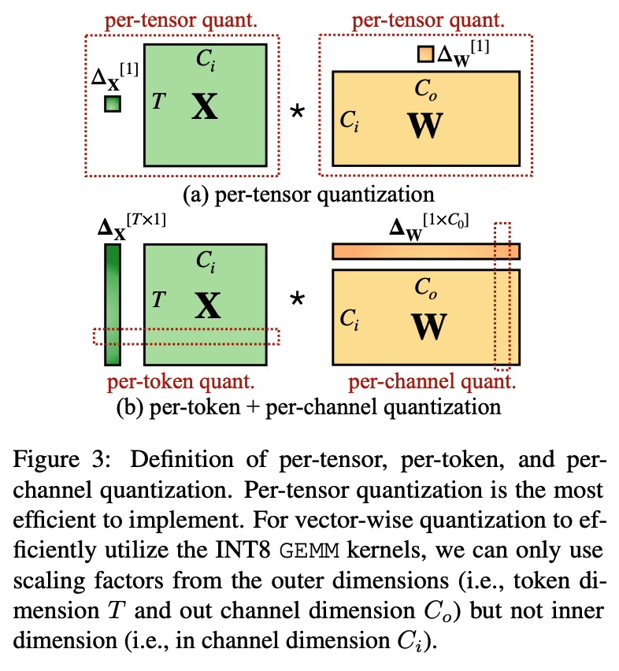
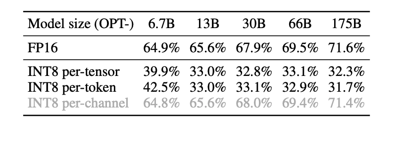

### SmoothQuant

- paper: https://arxiv.org/abs/2211.10438
- code: https://github.com/mit-han-lab/smoothquant

#### 背景

[LLM.int8()](https://arxiv.org/pdf/2208.07339) 论文里提出：

- activation 比 weight 更难量化，后者数据分布一般比较均匀。
- outlier 的存在会导致非 outlier 值在 per-tensor 级别的量化误差大。
- activation 的量化方式不适宜用 per-channel，weight 用 per-tensor 或者 per-channel 都可以，这是因为 activation 用 per-channel 的话很难 dequantize。
- LLM.int8() 使用混合精度推理，每次计算都会恢复异常值至 FP16，但这需要在运行进行异常值 detecting，scattering 和 gathering，计算非常慢。
- 研究发现 weight 分布是统一且平滑的，**使用 INT8 甚至 INT4 量化 LLM 的权重不会降低准确性**。

根据量化粒度的不同，量化方法可以分为逐层量化（per-tensor）、逐通道（per-token & per-channel 或者 vector-wise quantization）量化和逐组量化（per-group、Group-wise）。

作者对比了 per-channel、per-token、per-tensor 激活量化方案。在这几种不同的激活量化方案中。per-tensor 量化是最高效的实现方式。但只有逐通道量化（per-channel）保留了精度，但它与 INT8 GEMM 内核不兼容。即 per-channel 量化不能很好地映射到硬件加速的 GEMM 内核（硬件不能高效执行，从而增加了计算时间）。

根据 [LLM.int8()](https://arxiv.org/pdf/2208.07339)  的发现，SmoothQuant 作者对 activation 使用不同的量化方式，发现 per-channel 量化模型的精度与 FP16 接近。

#### 技术实现

SmoothQuant 是一种同时确保准确率且推理高效的训练后量化 (PTQ) 方法，可实现 W8A8 量化。由于 weight 很容易量化，而 activation 则较难量化，因此，SmoothQuant 引入平滑因子 $s$ 来平滑 activation 异常值，通过数学上等效的变换将量化难度从 activation 转移到 weight 上。

